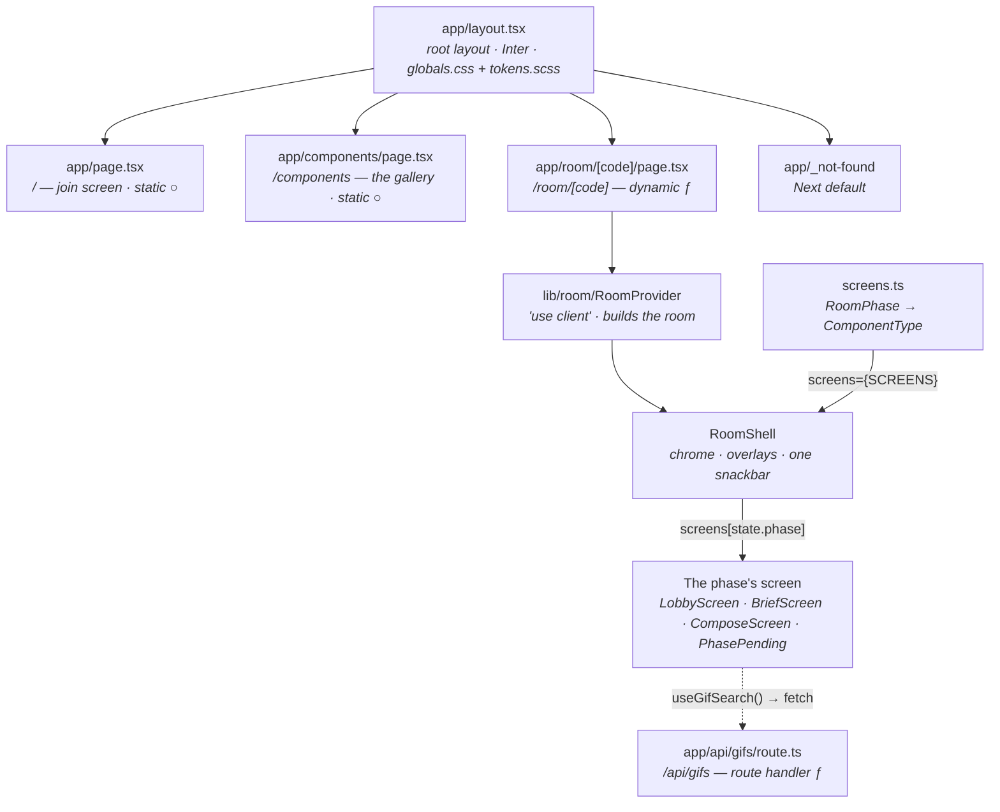
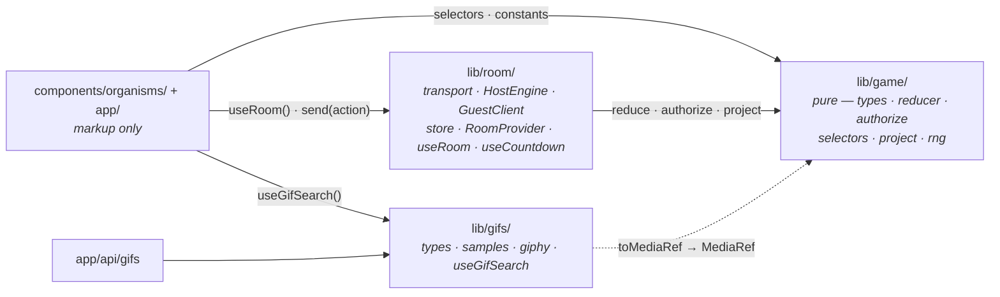
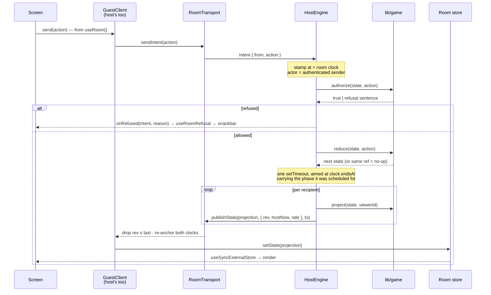
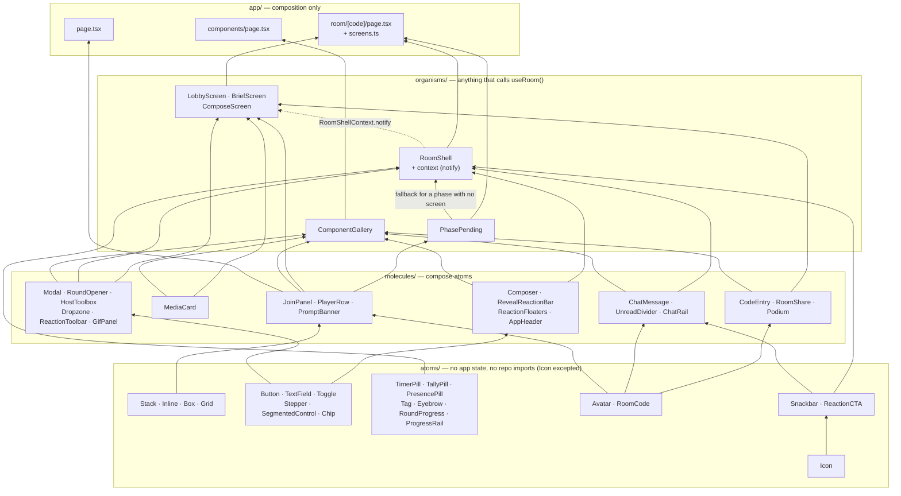
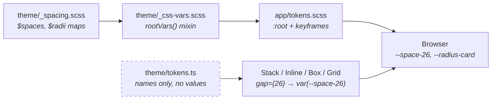
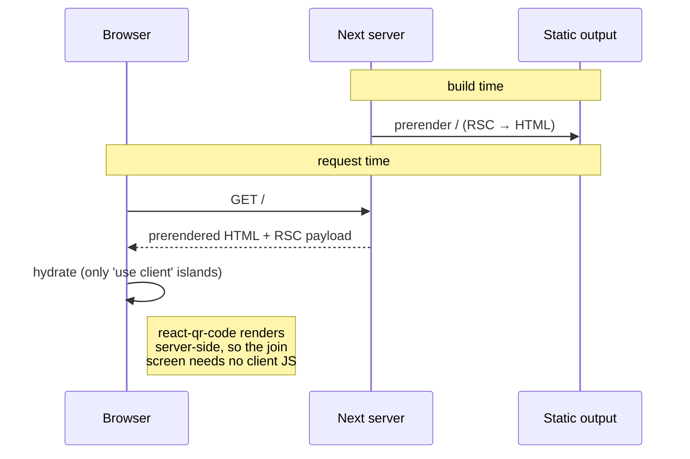
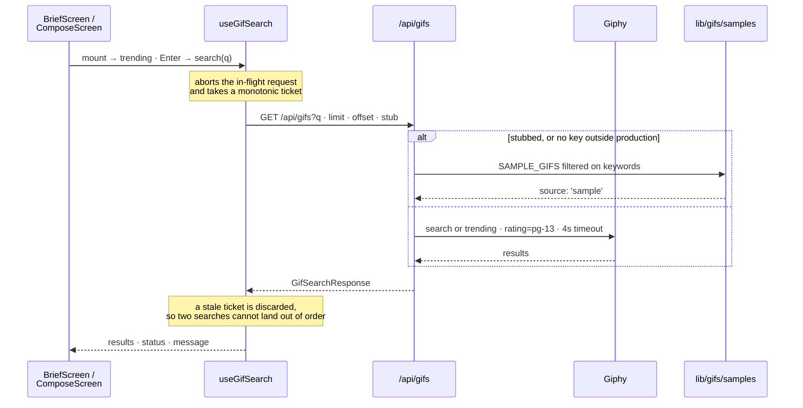

# Architecture

How Captionist is put together **today**. Regenerated by `/ship` after every
feature — if this file disagrees with the code, the file is the bug.

Companion docs: [design system](./design-system.md) · [roadmap](./roadmap.md) ·
[decisions](./adr/) · [component tiers](../components/README.md)

Current as of phase 2: the room renders real screens for four of its ten
phases.

The roadmap owns *what is being built next*, in phases. This file owns *what is
here now*. Where they overlap, this file links rather than repeats.

---

## Stack

| Layer | Choice | Notes |
| --- | --- | --- |
| Framework | Next.js 16 (App Router, Turbopack) | Bundled docs live at `node_modules/next/dist/docs/` — read those, not recalled APIs |
| UI | React 19 | Server Components by default; `'use client'` only where interactivity needs it |
| Language | TypeScript 5.9, `strict` | `@/*` path alias maps to the repo root |
| Styling | Sass modules + `theme/` tokens | `sassOptions.loadPaths` makes `@use 'theme'` resolve from anywhere |
| Layout | `Stack` · `Inline` · `Box` · `Grid` | Spacing is a token-typed prop; see "Token flow" below |
| Game state | `lib/game/` — pure reducer, no React | `reduce()` is total and pure; randomness is a seeded PRNG cursor in state |
| Room runtime | `lib/room/` — `RoomTransport` + `HostEngine` | The host browser is the server — see [ADR 0003](./adr/0003-host-authority-over-a-swappable-transport.md) |
| Realtime | Ably v2 (installed, unwired) | `LocalTransport` is the only implementation of `RoomTransport` today |
| GIF search | Giphy, proxied by `/api/gifs` | `GIPHY_API_KEY` is server-only; `lib/gifs/` holds the fetcher, the offline shelf and the shared types |
| Unit tests | Vitest 4, `node` environment | `lib/**/*.test.ts` only — anything needing a DOM is Playwright's job |
| E2E | Playwright 1.56.1, Chromium only | Pinned — see [ADR 0002](./adr/0002-pin-playwright-to-browser-build.md) |

## Commands

| Command | Does |
| --- | --- |
| `npm run dev` | Dev server on `http://127.0.0.1:3000` |
| `npm run verify` | `lint` → `typecheck` → `test:unit` → `build` — the gate before any push |
| `npm run test:unit` | Vitest, once. The pure core only (`vitest.config.mts`) |
| `npm run test:unit:watch` | The same suite, watching |
| `npm run test:e2e` | Playwright, both viewports |
| `npm run test:e2e:mobile` | Mobile project only |
| `npm run docs:pack` | Repomix pack → `docs/repomix-output.xml` (gitignored) |

No key is needed to run any of these. Without `GIPHY_API_KEY` the GIF route
serves the offline shelf outside production, so a fresh clone gets a working
picker rather than an error; `GIFS_STUB=1` forces the same thing with a key
present. `.env.example` documents both.

---

## Routes

Four routes of ours plus Next's own not-found, as `next build` reports them:

```
○ /              ○ /_not-found     ƒ /api/gifs     ○ /components     ƒ /room/[code]
```

`/` and `/components` are prerendered at build time. `/room/[code]` is dynamic
and everything inside it is client-driven. `/api/gifs` is a route handler — no
layout, no React, JSON only.



The page reads the segment and hands off; `screens.ts` is the only place that
knows which component a phase renders, so adding phase 3's screens is one line
each and `RoomShell` keeps no opinion about what it wraps. A phase with no
entry in the map falls back to `PhasePending`.

`/components` renders every built component in its states. It's the design
review surface and what `e2e/components.spec.ts` drives — the components are
verified against a real browser rather than a snapshot.

**`/room/[code]` is one route for the whole room; the phase is a render switch
inside it, not a URL.** A route per phase was rejected on purpose: transitions
are host-pushed and simultaneous for up to twenty clients, so each would be
twenty `router.push` calls that risk losing focus and scroll — and the back
button would become a time machine into a phase the room has already left. The
route is dynamic because it awaits `searchParams` (`params` and `searchParams`
are Promises in Next 16); the segment resolves through
`normalizeCode` or 404s, with `DEV` reserved as the harness room `C-DEV000`.

The phase is on the DOM as well as in state: `RoomShell` renders
`<main data-phase={state.phase}>`, and every room spec drives
`main[data-phase]` rather than guessing at copy. Phases without a screen render
`PhasePending`, which is deliberately not a spinner: it shows the real roster or
the live standings, and on `reveal` and `score` — the two phases that are
untimed by design — the host's advance button. Without that button a room with
no bots in it would stop permanently, so a full five-round game is playable
today.

`/api/gifs` is the repo's first route handler, and the shape every later server
route copies: the client asks it, it asks the third party, the credential never
crosses. `searchGiphy()` in `lib/gifs/giphy.ts` is the only code that reads
`GIPHY_API_KEY`, it pins `rating=pg-13` unconditionally so the picker's "SFW
filter on" promise cannot be raised by a caller, and it gives up after 4s
because the brief clock is 30s and a hung request must not eat it. Three
different switches land on the same offline shelf — `GIFS_STUB=1`, the
`?gifs=stub` lever forwarded as `?stub=1`, and a missing key outside production
— and they are all resolved inside the route, so no screen has to know which
one is on. `source: 'sample'` comes back in the body and the picker says so.

`app/layout.tsx` is the only place fonts and global CSS are loaded. Inter is
pulled by `next/font/google` and exposed to Sass as the `--font-inter` custom
property, so no component ever declares a font family directly.

## Room state

Three layers in a stack, plus `lib/gifs/` alongside — and the arrows only ever
point one way. **State lives in `lib/`; `components/` is UI.** Providers, stores
and hooks belong in `lib/room/` even though they are React — putting a provider
in `components/` would make a tier that is supposed to be about markup the owner
of room authority instead.



Every arrow is a dependency, and none of them point back.

`lib/game/` imports nothing outside itself — no React, no browser, no
transport. That is what makes `npm run test:unit` a node-environment suite and
why `vitest.config.mts` scopes itself to `lib/**/*.test.ts`. A screen reads it
directly, but only through the pure half: `selectors.ts` and `constants.ts`,
never the reducer. **Every string and every branch on a screen comes from a
named selector** — `viewKey`, `briefCopy`, `phaseLabel`, `canStart` — so the
decision about what a phase means lives in a file a node test can reach, and
the screen is left holding markup. The mutable half is reached only through
`lib/room/`, and what a screen sees of that is `useRoom()`, `useRoomRefusal()`
and `useCountdown()`.

`lib/gifs/` is the second lib, and it sits beside the room rather than under it.
The route handler and the browser hook both import it, which is exactly why
`GifResult` is declared there: a route reaching into `components/` would be the
wrong direction. `toMediaRef()` is the one-way door between a search result and
game state — `id` and `keywords` are dropped, because `MediaRef` has no id and
inventing one for a future upload would be a lie.

### Host authority

The host's browser is the server. One loop, in this order: **authorize → reduce
→ schedule → publish.** Nothing else may produce a `GameState`.



**Even the host's own actions take that road.** `RoomProvider.send` routes
through the local endpoint's `sendIntent`, not `engine.apply()` — going
straight into the engine skipped authorisation feedback, because `apply()` only
reports a refusal when it can name the intent behind it, so the local player's
refusals were dropped silently. The trip also costs the host the same
artificial latency a guest pays, which is the point: a screen that works here
works in phase 5. That decision, and the clock rate below, are recorded in
[ADR 0004](./adr/0004-the-host-is-not-a-special-case.md).

Five details are load-bearing:

- **`at` and `actor` are the host's to decide**, never the sender's. `actor`
  comes from the transport's authenticated identity, so a guest cannot act as
  someone else by editing a payload — and the pure reducer never calls
  `Date.now()`.
- **`clock/expired` is refused off the wire.** It is the engine's own event;
  accepting one from a guest would let anybody end a phase early. It carries
  the phase it was scheduled for, so a late or duplicate fire is a reducer
  no-op and there is no cancellation bookkeeping.
- **Projection is per viewer.** Authorship is stripped from every entry but the
  viewer's own while voting is open, so the host publishes one payload per
  recipient rather than one broadcast. Anonymity is redaction, not restraint —
  every client holds the whole room. This is the one part of the interface an
  Ably channel does not satisfy for free; the options are recorded in
  [ADR 0003](./adr/0003-host-authority-over-a-swappable-transport.md).
- **`rev` orders; `hostNow` *and* `rate` sync.** Guests drop anything at or
  below the revision they last applied. A broadcast carries both where the
  host's clock was and how fast it is moving, and `GuestClient` anchors the
  pair — `hostAnchor`, `localAnchor`, `rate` — instead of storing a single skew
  offset. A lone offset is correct only at the instant it is measured: under
  `?fast=80` the host's deadline sits on a clock running 80× while the guest's
  advances at 1×, so between broadcasts the visible countdown stalled and then
  snapped. `roomNow()` now scales the elapsed local time, and the number moves
  smoothly in the gaps. `rate` is a property of the host's clock, so it rides in
  `StateMeta` and the domain never learns it exists.
- **A refusal is an event, not a value.** It goes back to the one player who
  asked — `RoomProvider` filters on `intent.from`, so a bot being told to sit a
  round out is the harness working, not something to interrupt over — and it
  arrives as a subscription rather than state, because re-rendering a refusal
  back into view later would be a lie. `authorize.ts` returns finished
  sentences, so `RoomShell`'s handler is just the snackbar queue. Note the
  shape of the arrow: today the refusal is an in-process callback from the
  engine, which is enough while every endpoint shares a page. A refusal for a
  genuinely remote guest has to travel back over the transport, and
  `RoomTransport` has no message for it yet — that is phase 5's to add.

`LocalTransport` is deliberately asynchronous — ~80ms with jitter, and still a
microtask at zero latency. A synchronous local transport would mean no screen
ever needed a pending state, and every submit path would be rewritten the day
Ably lands.

### The visible clock

`useCountdown(clock)` is the only thing that turns a deadline into a number on
screen, and it deliberately never touches the store. `store.ts` forbids anything
time-varying in the snapshot — `getSnapshot()` has to return a stable reference
or React 19 re-enters its render loop — so the countdown is local state driven
by an interval, and the arithmetic stays a pure function of `(clock, roomNow)`.
It takes the `Clock` as an argument rather than reading the room, which lets
`RoomShell` own the single interval serving the whole page. It ticks four times
a second, not once, because `?fast=80` lands a room-second every 12ms; it
re-renders only when a displayed second actually changes, and a paused or idle
clock gets no interval at all.

### Dev levers

Seven now: `?seed=` · `?bots=` · `?fast=` · `?phase=` · `?mode=` · `?as=` ·
`?gifs=`, read once in `RoomProvider` and gated to non-production in
`lib/room/levers.ts` — in a production build every lever reads as absent
whatever the query string says. `?bots=` spawns guests *over the transport*, so
authorisation and ordering are exercised rather than bypassed; `?fast=` scales
the host's clock rather than the page's, because `page.clock` is per-page and
would desynchronise a room split across tabs. What each one is for is in
[the roadmap](./roadmap.md#the-url-levers).

`?as=p2` is the structural one. It only means anything alongside `?phase=`,
because it takes a seat that already exists and a fresh room's other seats stay
empty until phase 4 lets anyone join. When it is set the local endpoint stops
being the host's own `GuestClient` on the host transport and becomes a real
guest with its own transport and its own seat — the first exercise of the guest
path ahead of phase 4 depending on it — and the bot loop skips that id, since
two drivers in one chair would submit twice and vote against themselves.

## Component tiers

Tier is decided by dependencies, not size. Full rules in
[`components/README.md`](../components/README.md).



`organisms/` is the tier that grew. **An organism is anything that calls
`useRoom()`** — that, not size, is why a 90-line `PhasePending` is one and a
190-line `GifPanel` is not. `RoomShell` owns everything outside the content
column: the header and its clock, the docked rail, the host toolbox, the help
modal, the round-opener overlay and one snackbar at a time. A screen owns its
content column and nothing else, which is what stops ten screens each growing
their own header. The only thing a screen may ask of the chrome is
`notify()`, through `RoomShellContext` — which falls back to a no-op rather
than throwing, so a screen still renders on its own in the gallery or a test.

The screens are injected, not imported: `RoomShell` takes a
`Partial<Record<RoomPhase, ComponentType>>`, and the map lives in
`app/room/[code]/screens.ts`. The one screen `RoomShell` imports directly is
`PhasePending`, as the fallback for a phase the map does not cover. The dotted
edge is the return path: the shell hands screens `notify()` through context.

`Stack`, `Inline`, `Box` and `Grid` are the layout primitives. They hold no
state and render no text, so they're atoms by the dependency rule — and they're
server components, so using them costs no client JS.

`Icon` is the one component atoms may import; the reasoning is in
[`components/README.md`](../components/README.md). Everything that takes user
input is `'use client'` and **controlled** — it owns no state, so the same
`Toggle` works in the setup screen and the host toolbox without either one
fighting it for ownership.

## Token flow

Values exist exactly once. Sass owns them; React reads them by name.



`theme/tokens.ts` contains no numbers — only the legal token names and the
`var()` references built from them. So `gap={13}` is a type error (13px isn't in
the design), and changing a value stays a one-line edit in Sass.
`e2e/tokens.spec.ts` asserts the bridge reaches the browser: if it breaks, every
gap silently falls back to `0` and no other test would fail.

The chat rail's two widths now travel the same road — `rootVars()` publishes
`--rail-width` and `--rail-width-collapsed`, `RoomShell.module.scss` picks
between them and 0 at the breakpoints as `--room-rail-width`, and
`HostToolbox` takes that custom property through its `railWidth` prop (widened
from `number` to `number | string` for exactly this). The offset has to survive
a media query, so it is decided in CSS; React only passes the name along. This
is the exception that proves the rule about layout values: it is in `theme/`,
not inlined, and no component owns a second copy of the number.

## Rendering path

Three paths now. `/` and `/components` are built at compile time and served as
static HTML.



`/room/[code]` is the second path and it is the opposite shape: the server
renders an empty shell — the store's `getServerSnapshot()` returns the
never-connected room precisely so `useSyncExternalStore` has something to hand
SSR — and everything after that happens in the browser. There is no server
state. `RoomShell` renders its chrome and a "Joining the room…" line while
`state` is undefined, so the page has shape before the first broadcast; nothing
below that guard may read `state`. The first render a player sees comes from
the host's own broadcast arriving over the transport, which on a host-only room
is a loop straight back to itself.

The third path is the only one that leaves the machine, and it belongs to the
GIF picker rather than to a page.



There is no debounce anywhere in that path, on purpose: the design's picker says
"Enter to search", so a request fires on submit and on a suggestion chip, which
deletes the debounce-and-race question entirely. What is left is the stale
guard. A picked result becomes a `MediaRef` through `toMediaRef()` and is
broadcast to the room — which is why the sample shelf is twelve SVGs under
`public/media/` rather than data URIs, since a full-state message has to fit
inside Ably's 64KB cap.

---

## Not yet built

Designed but not implemented. The shape is settled — `DESIGNSYSTEM.md` and the
three `.dc.html` files specify all of it, and since the spine landed the state
model does too. What's missing is code, in the order
[the roadmap](./roadmap.md#phases) gives; that table is the plan and is not
repeated here.

| Area | What exists | What doesn't |
| --- | --- | --- |
| The round-flow screens | Four of the ten phases render for real — `lobby`, `opener` (the `RoundOpener` overlay), `brief` and `compose` — inside the `RoomShell` chrome drawn above | `waiting`, `vote`, `tiebreak`, `reveal`, `score` and `podium` all render `PhasePending` — real data, real advance control, none of the designed layout |
| Joining a room | `normalizeCode`, `player/joined`, seat-holding, and `?as=p2` driving a genuine guest endpoint | Landing, `/join`, `/join/[code]`, `/host`. Every room is created by, and for, its host. The code on `/` is still hardcoded, and `LobbyScreen`'s guest face (settings read-only, no controls) waits on real joining |
| Realtime transport | `RoomTransport` + `LocalTransport` (one tab) | `BroadcastTransport`, `AblyTransport`, `/api/ably/token`, presence UI, reconnect overlay |
| Player avatars | `avatarSeed` travels in state; `Avatar` falls back to the initial on the player's colour | `@dicebear/*` is installed and unused — nothing turns a seed into art, and `Player.src` is never populated |
| Iconography | `Icon` ships the design's own SVG paths | `@phosphor-icons/react` is installed and unused |
| Uploads | `Dropzone` renders `blocked` with the reason on it | Anywhere for a file to live. Blocked in v1 by decision, not by omission — `BriefScreen`'s "Upload your own" tab says so rather than hiding |
| Chat + live tallies | `ChatRail` docks and lays every screen out around it, `RoomEvent` on the transport | Anything to put in it. The rail body is a placeholder line; nothing publishes an event yet, and the phone's chat sheet lands with chat itself |

The component library is complete — see the inventory in
[design-system.md](./design-system.md#component-inventory). The design's
prototype has **16 state branches**. Three of them — landing, join and setup —
are routes rather than phases, because no room exists during them; the
remaining 13, plus the round opener overlay, are the **14 in-room states**.
Those normalise to the **10 room phases** in `RoomPhase`
(`lib/game/types.ts`): `pick`/`pickwait`/`prompt`/`promptwait` are one phase
(`brief`) rendered four ways, and `caption`/`submit` are another (`compose`).
Phase is room-wide and authoritative; "is it my turn" is per-viewer and
derived, which is what makes *never fork a shared screen* a type-level fact
rather than a discipline. `BriefScreen` and `ComposeScreen` are that rule in
code: one organism each, seven faces between them — four brief, three compose —
and which one renders comes from `viewKey(state, viewerId)` in
`lib/game/selectors.ts`, so neither screen ever asks which mode the room is in.
Every string on them comes from `briefCopy` / `composeCopy` for the same reason.
Six screens remain, one per uncovered phase.

The client ↔ API-route ↔ Ably diagram is still owed, and lands with
`AblyTransport` in phase 5. Its shape is no longer hypothetical, though: the
[GIF path](#rendering-path) above is the same one — browser to route handler to
third party, with the credential stopping at the server — and `/api/ably/token`
will be `searchGiphy`'s sibling. The authority decision it will extend is
already recorded in
[ADR 0003](./adr/0003-host-authority-over-a-swappable-transport.md).

## Conventions worth knowing before you edit

1. **`CLAUDE.md` is ours; `AGENTS.md` is Next's.** `next dev` regenerates the
   block between `<!-- BEGIN:nextjs-agent-rules -->` markers in `AGENTS.md` and
   skips `CLAUDE.md` entirely while that block lives there. Put project rules in
   `CLAUDE.md`.
2. **The repomix pack is an input, not a doc.** `docs/repomix-output.xml` is
   gitignored; this file is the committed output derived from it.
3. **Never run `playwright install`.** The browser cache is provisioned; see
   [ADR 0002](./adr/0002-pin-playwright-to-browser-build.md).
4. **State goes in `lib/`, markup goes in `components/`.** Providers, stores
   and hooks live in `lib/room/` even though they are React. `lib/game/` stays
   importable from a node test with no DOM — keep React, `Date.now()` and
   `Math.random()` out of it.
5. **Pure logic is Vitest's; anything rendered is Playwright's.** The unit
   suite is scoped to `lib/**/*.test.ts` on purpose — components are verified
   against the real browser this app ships to, not a simulated DOM. Screen copy
   counts as pure logic: it lives in selectors, so `lib/game/selectors.test.ts`
   asserts the words and the specs assert the wiring. `/api/gifs` is tested
   through Playwright's `request` fixture rather than a browser, against the
   stub — a spec that depends on a live third party is not a test.
6. **Anything that calls `useRoom()` is an organism.** That is the whole test —
   not size, not how much markup it holds. A component that needs room state
   belongs in `components/organisms/`, and one that only needs props stays a
   molecule so the gallery can still render it.
7. **Selectors passed to `useRoomSelector` must be module-level.** The cache is
   keyed on snapshot identity, so an inline closure that changes meaning
   between renders would be served from cache.
8. **The phase-2 screens use `useRoom()`, not `useRoomSelector`, on purpose.**
   Nothing they render is a list long enough to pay for the cache — a lobby
   roster is twenty rows that all change together anyway. `useRoomSelector`
   exists for phase 3's vote grid, where twenty live cards would otherwise
   re-render on every broadcast. Reach for it when there is a list; until then
   the whole snapshot is one subscription and one render.
9. **Nothing time-varying goes in the store.** `getSnapshot()` must return a
   stable reference or React 19 loops. Clocks are derived in `useCountdown`,
   and refusals are delivered as a subscription rather than parked in state.
