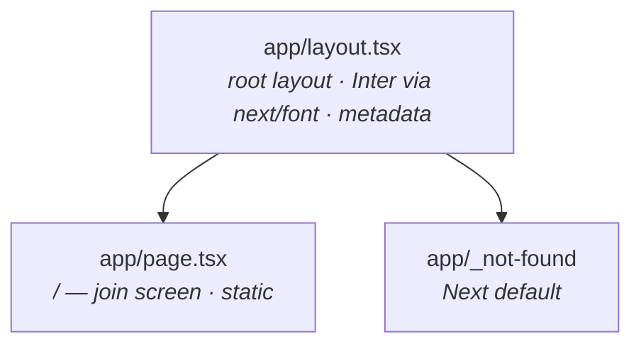
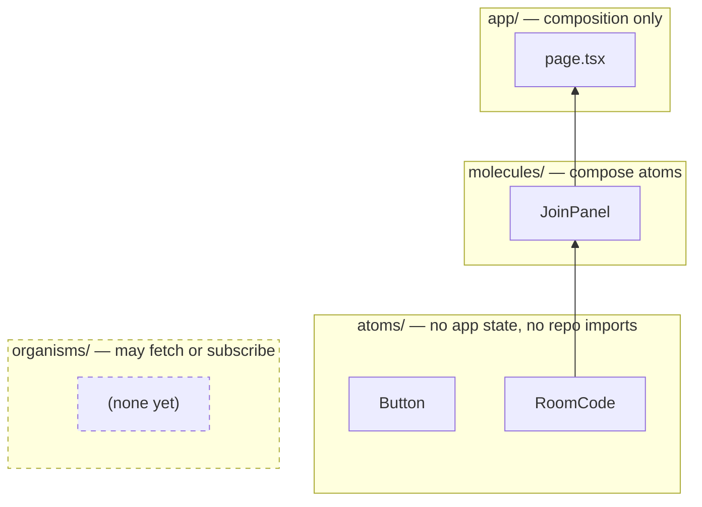

# Architecture

How Captionist is put together **today**. Regenerated by `/ship` after every
feature — if this file disagrees with the code, the file is the bug.

Companion docs: [design system](./design-system.md) ·
[decisions](./adr/) · [component tiers](../components/README.md)

---

## Stack

| Layer | Choice | Notes |
| --- | --- | --- |
| Framework | Next.js 16 (App Router, Turbopack) | Bundled docs live at `node_modules/next/dist/docs/` — read those, not recalled APIs |
| UI | React 19 | Server Components by default; `'use client'` only where interactivity needs it |
| Language | TypeScript 5.9, `strict` | `@/*` path alias maps to the repo root |
| Styling | Sass modules + `theme/` tokens | `sassOptions.loadPaths` makes `@use 'theme'` resolve from anywhere |
| Realtime | Ably v2 (installed, unused) | See "Not yet designed" below |
| E2E | Playwright 1.56.1, Chromium only | Pinned — see [ADR 0002](./adr/0002-pin-playwright-to-browser-build.md) |

## Commands

| Command | Does |
| --- | --- |
| `npm run dev` | Dev server on `http://127.0.0.1:3000` |
| `npm run verify` | `lint` + `typecheck` + `build` — the gate before any push |
| `npm run test:e2e` | Playwright, both viewports |
| `npm run test:e2e:mobile` | Mobile project only |
| `npm run docs:pack` | Repomix pack → `docs/repomix-output.xml` (gitignored) |

---

## Routes

Only one route exists. Every page is statically prerendered; nothing fetches
data yet.



`app/layout.tsx` is the only place fonts and global CSS are loaded. Inter is
pulled by `next/font/google` and exposed to Sass as the `--font-inter` custom
property, so no component ever declares a font family directly.

## Component tiers

Tier is decided by dependencies, not size. Full rules in
[`components/README.md`](../components/README.md).



`Button` is not yet used by any page — it exists as the canonical file-shape
template for new atoms.

## Rendering path

Nothing is dynamic yet, so the whole join screen is built at compile time and
served as static HTML.

```mermaid
sequenceDiagram
  participant B as Browser
  participant N as Next server
  participant S as Static output

  Note over N,S: build time
  N->>S: prerender / (RSC → HTML)

  Note over B,S: request time
  B->>N: GET /
  N-->>B: prerendered HTML + RSC payload
  B->>B: hydrate (only 'use client' islands)
  Note right of B: react-qr-code renders<br/>server-side; no client JS<br/>needed for the join screen
```

---

## Not yet designed

Deliberately absent, not overlooked. Four dependencies are installed and unused,
which signals intent but not a settled shape:

| Area | Dependency present | Status |
| --- | --- | --- |
| Rooms — creation, codes, lifecycle | — | Room code on `/` is a hardcoded placeholder |
| Realtime caption transport | `ably` v2 | No channels, no API route, no token minting |
| Participant identity + avatars | `@dicebear/core`, `@dicebear/collection` | Unused |
| Iconography | `@phosphor-icons/react` | Unused |

When the first realtime feature lands, add a data-flow diagram here covering
the client ↔ API-route ↔ Ably channel path, and record the decision in an ADR.
Until then this section stays as the honest answer.

## Conventions worth knowing before you edit

1. **`CLAUDE.md` is ours; `AGENTS.md` is Next's.** `next dev` regenerates the
   block between `<!-- BEGIN:nextjs-agent-rules -->` markers in `AGENTS.md` and
   skips `CLAUDE.md` entirely while that block lives there. Put project rules in
   `CLAUDE.md`.
2. **The repomix pack is an input, not a doc.** `docs/repomix-output.xml` is
   gitignored; this file is the committed output derived from it.
3. **Never run `playwright install`.** The browser cache is provisioned; see
   [ADR 0002](./adr/0002-pin-playwright-to-browser-build.md).
