# Architecture

How Captionist is put together **today**. Regenerated by `/ship` after every
feature — if this file disagrees with the code, the file is the bug.

Companion docs: [design system](./design-system.md) · [roadmap](./roadmap.md) ·
[decisions](./adr/) · [component tiers](../components/README.md)

Current as of phase 7: **a message can carry a picture and answer a caption.**
The event lane's `chat` variant now takes an optional `attachment` and a
`replyTo` quote, the reaction picker put its 32 reactions behind pack tabs
with the design's four Slackmoji tiles among them, and the two `/host` settings
that no screen read — `voting: 'single'` and `format: 'one'` — are read. Still
nine routes and ten phases; nothing about the shape of a room moved. (A tenth
route has landed since: the 404 page below.)

**Since then the reaction catalog grew from 32 to 616, and the wire did not
change.** 584 emoji were imported from Google's Noto Animated Emoji under CC BY
4.0 and committed as still SVGs under `public/media/emoji/`, so a reaction still
renders with no network, no credentials and no third party. They land *behind*
the curated 32, which keep positions 1–32, so every head-slice the room takes
off `REACTIONS` is what it was.
[ADR 0012](./adr/0012-the-catalog-is-licensed-art-and-the-animation-is-borrowed.md).

Widening the lane asked a question the text-only one never had to: **what may a
message point at?** Every sender-supplied URL — an attachment, a quote's
thumbnail, a reaction's glyph — lands in an `` in *every* member's
browser, so an unchecked one is one player making twenty browsers fetch a host
of their choosing. `lib/gifs/allow.ts` is the single allowlist all three clear,
and the reaction lane was the sharp edge: the wire carries a *glyph*, which was
harmless while every glyph was an emoji and a URL the moment tiles existed.
Both halves — a quote is a copy, a glyph is a location — are
[ADR 0011](./adr/0011-a-quote-is-a-copy-and-a-glyph-is-a-location.md).

**Growing the catalog did not widen that answer, and the naive reading of it is
the opposite of what happened.** The animation is Google's, on
`fonts.gstatic.com` — but that URL never travels. The lane carries the same
same-origin still it always did, and every browser derives the animated
rendition from it locally through `lib/noto.ts`. So the allowlist gained one
*optional path segment*, `/media/(emoji/)?…\.svg`, and no remote host at all;
`lib/gifs/allow.test.ts` asserts that a gstatic URL is still **refused**, so the
day that changes it will be on purpose.

**Since then the room's floating controls stopped being the host's.**
`HostToolbox` is `RoomToolbox`: everyone gets one, it leads with a "React to the
room" row and the walkthrough, and the host's timer, pause, skip, switch-mode,
force-tie, jump and restart are an extra section behind an optional `host` prop
rather than a second, host-shaped component. The room's reaction picker moved
*into* it — off the collapsed chat rail, where it read as a chat feature and sat
a tap from the composer's emoji, which are a different thing. `ChatRail` lost
`onReact` and `RoomShell`'s `Overlay` union lost `'reactions'`, so "one overlay
surface at a time" now holds with one fewer thing to remember. Nothing on the
wire moved: a room reaction is the same event it was.

**The rail now greets you open where it can dock.** `RoomShell` derives its
initial state from `useWideViewport()` rather than storing `false` — chat is
open from `md` up, closed below it, and your own toggle overrides the viewport
from the moment you touch it. A phone keeps its closed rail on purpose: there
the rail is a full-screen sheet, and arriving inside it would take the room
away from somebody who just got there. That change is also why `LobbyScreen`
became a **container** rather than a set of viewport breakpoints — with 360px
of rail docked, the window no longer describes the column the lobby is laid out
in, and the room code, the player names and the empty seat were all wrapping or
truncating against a measure that had silently shrunk.

**The lobby is two layouts, because the design draws two artboards.** A host's
lobby is a work surface — a QR to share, a mode to set, a button to press — and
it is laid out as one. A guest's is a waiting room: one centred column under
the accent glow, a headline at `displaySmallText`, one 820px card carrying the
roster and the rules read-only, and a `StatusPill` under it. That is not the
host's screen with its controls hidden, which is what a guest used to get — the
host's two-column layout with the left column empty and everything shoved
against one edge. `LobbyScreen` still owns both, as `HostLobby` and
`GuestLobby` in one file: they are one phase, they share `lobbyCopy`,
`settingsSummary` and `PlayerRow`, and only the arrangement differs. Branching
on *role* is not the thing the mode rule forbids — that rule is about never
forking a screen on `settings.mode`, and neither half of this one reads it.

**Five glows, one mixin — and four of them had never painted.** The
accent circle every big screen carries is a `::before` at `z-index: -1`.
Without a stacking context on its own element it escapes to the root one, where
`RoomShell`'s opaque canvas background paints *over* it — block backgrounds are
painted after negative-z-index descendants. The design's own guest-lobby
artboard carries `isolation:isolate` on exactly that wrapper, which is the
tell. `RevealScreen`, `PodiumScreen` and `TiebreakScreen` had declared the same
glow since phase 3 and none of them had ever shown it: the same shape of silent
failure as the five animations below, found the same way — by drawing the thing
and noticing it was not there.

Turning them on exposed the second half of the bug, which only a *visible* glow
can have. `radial-gradient(circle, …)` sizes to `farthest-corner`, so its last
stop lands about 96% of the way to the box's side and the circle is still lit
at its own edge; a fixed 900–1300px circle inside a 353px phone column was
therefore a lit rectangle with `overflow: clip` for edges. Two changes fix it
everywhere: the circle is `min(<design px>, 100%)` of the column with its
offset expressed as a fraction of its own height, so a narrower column gets the
same shape at its own size; and on the three round screens the clip is
horizontal only — their content ends well above the circle's bottom, so
clipping both axes cut the fade off mid-gradient and drew a line across the
canvas. The vertical spill has nowhere bad to go: `RoomShell` clips the
viewport and the header paints over it. The guest lobby needed the same: its
box starts below the header, so clipping there drew the hard line mid-page that
the round screens had. It is all one `screenGlow()` in `theme/_elevation.scss`
now, and the host's half of the lobby carries it too — the design's host
artboards draw it, and this is one room before it starts rather than two.

**Two structural fixes rode along with it, and one of them was silent.** Five
animations had never run. `theme/_motion.scss` declared its keyframes once in a
*global* stylesheet, and CSS Modules rewrite `animation-name` into module scope
— so every rule naming `pop`, `pulse`, `rise`, `caret` or `toastin` asked for a
keyframe nothing declared, and the element rendered in its static state with no
warning. It is one mixin per animation now, included by the module that names
it: [ADR 0013](./adr/0013-a-keyframe-is-scoped-to-the-module-that-names-it.md).
The other is layout: **from `md` up the room is an app shell rather than a
scrolling page.** `RoomShell` is `height: 100dvh; overflow: hidden` and the
content column is what scrolls, so the docked rail is the height of the viewport
and its composer no longer hangs below the fold until the header is scrolled
away. Below `md` nothing changed — the rail is a sheet and the page scrolls.

**Since then a player picks a face out of sixty-four rather than seven.**
`AVATAR_SEEDS` grew from seven seeds to sixty-four — eight pages of exactly
eight — and the style went with it: seven flat `funEmoji` faces do not stay
tellable apart sixty-four times, so `lib/avatar.ts` draws DiceBear's
combinatorial `critters` instead. That forced a major version (`critters` exists
only in DiceBear 10, and `@dicebear/collection` has no 10), which is the one
consequence [ADR 0008](./adr/0008-avatar-art-is-derived-at-the-edge.md) had
called a one-constant edit; the amendment records what it actually cost, in
bytes that were measured. Nothing about the decision moved: the seed still
travels and the art is still derived in each browser. `AvatarPicker` shows a
window of eight with its own `Shuffle faces` button — a real `radiogroup` with
arrow keys, faces named `Ember` and `Sunfish` rather than `Face 1` — and the
opening window is `avatarPage(seed)`, a pure function, so the server and the
browser draw the same eight and hydration has nothing to disagree about.

**The hero wall stopped leaving holes in itself.** Its grid sized tiles —
`auto-fill` over a 300px minimum — which made the column count a function of the
window, and at every width where that count did not divide twenty the last row
came up short. It counts tracks now: `$wall-columns` × `$wall-rows`, 4×5 on a
phone and 5×4 from `md` up, so twenty tiles fill twenty cells at any viewport.

**Since then uploads stopped being a not-yet and became a no.** Custom image
upload had been drawn, built and blocked since the design landed: `Dropzone`
rendered `blocked` in the gallery and nowhere else, `BriefScreen` carried a
"Search Giphy / Upload your own" tab pair whose second tab explained itself
instead of working, `/host` drew a permanently disabled toggle with a reason
under it, and `MediaRef.source` was a `'giphy' | 'upload'` union nothing read.
The storage target was finally priced, and the cost was never the problem —
what it bought was a vendor and a token in an app whose authority model is "no
database", a cleanup cron, and a "the image lives only for the game" claim a
CDN cache makes unkeepable. So the scaffolding went rather than staying as a
promise: `components/molecules/Dropzone/` is deleted, `GifPanel` renders
unconditionally on the brief, the `/host` row is **absent rather than
disabled**, `MediaRef` is `{ src, alt }`, `Icon` is back to the eleven glyphs
its docblock always claimed, and four `$dropzone-*` metrics left
`theme/_metrics.scss`. Giphy is the only image source, in both modes.
[ADR 0014](./adr/0014-uploads-are-not-a-feature.md).

**Two things about that removal are worth reading carefully.** It suspends this
repo's own rule that the design is the source of truth: `design/DESIGNSYSTEM.md`
§126 still specs the Dropzone, and `design/` is left untouched rather than
edited, because the delivered design is a record of what was designed rather
than a mutable file. Everywhere else the code omits something the design draws,
this file lists it as an omission; here the ADR is the explanation instead.
And the *absence* is what `e2e/host.spec.ts` asserts now — `/upload/i` matches
nothing on `/host`, so the removal is a test rather than a habit. `CLAUDE.md`'s
rule 10, *blocked is not disabled*, is for an action unavailable *right now*; it is
the wrong shape for one that will never be available, and the caption-format
row — dropped entirely in react mode rather than shown dead — already set that
precedent. `SegmentedControl`'s `icon` prop is the one survivor: it is
design-specified and stays, but nothing in production sets it, because the
uploader tabs were its only caller and the gallery case demonstrating it was
demonstrating them.

**Since then a room opens on a screen rather than a sentence.** `RoomShell`'s
early return was a bare `AppHeader` and the words "Joining the room…",
identical for the person building a room and the person asking to be let into
one, with no way out of either. It is `RoomBootScreen` now — one organism, one
`variant` prop, values rather than a fork: the same card, ringed badge and
three-row checklist both times, with the copy, what the ring holds and where
Cancel goes branching on the role. **The gate under it moved too, and that is
the bug the screen found.** It was `!state`, which only ever proved *a room
exists*; a guest still has to ask for a seat and be given one, so for as long as
that took the lobby drew a roster its own viewer was missing from. Both the
hand-off and the refusal path read one predicate now — `isSeated(snapshot)` in
`lib/room/store.ts` — so they cannot disagree about what "joined" means. And a
refusal arriving before seating, a full room most likely, lands in
`boot.failure` on the screen that is actually showing rather than in a snackbar
the boot branch never rendered, which is how a refused guest used to spin
forever.

**What the rows say is what the room actually does.** `RoomSnapshot` carries a
`BootProgress` — `probing → claiming → waiting → seating` — stamped by
`RoomProvider` through the boot it was already running, and `boot.role` is
seeded from *intent*, since nobody knows who hosts until the election resolves
and a host seeded as a guest would open on the wrong screen and flip a beat
later. The only invented thing is *pacing*, not progress:
`lib/room/bootTimeline.ts` holds a row for 220ms and the whole screen for 900ms
before it may hand over, both scaled by `?fast=` and skipped entirely for a
`?phase=` fixture, which is the room rather than a boot of one. The rule the
whole screen is built on — every row names a milestone that actually resolves,
and where the work does not exist the copy moves rather than the work being
invented to match it — is
[ADR 0015](./adr/0015-a-progress-screen-may-not-invent-a-stage.md).

**Since then the app answers a URL it doesn't have.** `app/not-found.tsx` makes
`/_not-found` ours rather than Next's default black page, and being a *root*
`not-found.tsx` it catches both an unmatched URL and any `notFound()` thrown
deeper — today `/room/[code]` refusing a code that was never a code. It is the
best evidence so far that rule 1 is holding: a whole page arrived and the
component tier map did not move, because `MediaCard`, `TallyPill`, `Wordmark`,
`Eyebrow` and two `Button href`s already existed and the page is a round nobody
won. The route is [below](#routes).

**The card it borrows changed shape under every screen that draws one.**
`$media-ratio: 1 / 1` replaced the design's fixed `$media-height` /
`$media-height-lg`, because at the widths a card is actually laid out at — 307px
in the vote grid, 520px in the compose preview — a 186px image is a 1.6:1
letterbox with the caption stranded in a strip across it. That is a **departure
from the design rather than an omission of it** — `DESIGNSYSTEM.md` §3 states
both the height and the caption's 14–32px, and both are overruled — so it is
[ADR 0016](./adr/0016-a-media-card-is-square-and-a-caption-scales-with-it.md)
and a row in [design-system.md](./design-system.md) rather than a quiet edit.
The overlays went with it: they are sized in `cqw` against the card rather than
the window, which is what `container-type: inline-size` on `.frame` is for — a
307px vote tile and a 550px hero card sit at the same viewport, so a single `vw`
clamp would be right for exactly one of them.

**The GIF picker stopped being a grid for the same underlying reason.** A GIF is
any ratio it likes and Giphy's `fixed_width` rendition pins only the width, so a
grid of fixed-height tiles cropped every one of them; `GifResult` now carries
that rendition's `width`/`height`, the tiles are CSS `columns` with each tile's
own `aspect-ratio` on it, and nothing on the wire moved — the dimensions are a
rendering hint `toMediaRef()` drops with `id` and `keywords`.

Phase 6 stands as built: **the room can talk while it plays.** Chat and live
reaction tallies ride the transport's event lane into a second store that sits
*beside* `RoomStore` rather than inside it — a message never bumps `rev`, never
re-broadcasts the room, and the reducer never sees one. The rail phase 2 docked
is now full: a sheet on a phone, the docked rail above `md`, one component
branching in its own stylesheet.

Phase 6 also closed a hole rather than adding a feature. The intent lane always
stamped `from` from the authenticated sender; the event lane took it from the
payload, which was harmless while nothing published events and "post as anyone
in the room" the moment chat did. **All three transports now stamp `from` on
receive** — [the event lane](#the-event-lane), reasoned out in [ADR 0010](./adr/0010-chat-is-a-second-store-and-its-sender-is-stamped.md).

Phase 5 stands as built: `AblyTransport` is the third `RoomTransport` and the
one a real room takes, presence elects the host and drives the roster, and a
player who drops gets an overlay over the room they are still holding — the
reasoning is [ADR 0009](./adr/0009-the-room-crosses-the-network.md). **Its gate
is still unverified**, and this file says so rather than implying the swap is
proven: the suite is pinned to `BroadcastTransport` by `ABLY_STUB: '1'` in
`playwright.config.ts`, so nothing automated has ever touched Ably. See
[what is verified, and what is not](#what-is-verified-and-what-is-not).

The roadmap owns *what is being built next*, in phases. This file owns *what is
here now*. Where they overlap, this file links rather than repeats.

---

## Stack

| Layer | Choice | Notes |
| --- | --- | --- |
| Framework | Next.js 16 (App Router, Turbopack) | Bundled docs live at `node_modules/next/dist/docs/` — read those, not recalled APIs |
| UI | React 19 | Server Components by default; `'use client'` only where interactivity needs it |
| Language | TypeScript 5.9, `strict` | `@/*` path alias maps to the repo root |
| Styling | Sass modules + `theme/` tokens | `sassOptions.loadPaths` makes `@use 'theme'` resolve from anywhere |
| Layout | `Stack` · `Inline` · `Box` · `Grid` | Spacing is a token-typed prop; see "Token flow" below |
| Game state | `lib/game/` — pure reducer, no React | `reduce()` is total and pure; randomness is a seeded PRNG cursor in state |
| Room runtime | `lib/room/` — `RoomTransport` + `HostEngine` | The host browser is the server — see [ADR 0003](./adr/0003-host-authority-over-a-swappable-transport.md). `RoomSnapshot.boot` is the same runtime reporting where an *opening* room has got to, and `isSeated()` is the one predicate that says whether this tab is in it yet |
| Chat + tallies | `lib/room/events.ts` — a second store, beside `RoomStore` | [ADR 0010](./adr/0010-chat-is-a-second-store-and-its-sender-is-stamped.md) — the event lane, never game state: a message must not bump the `rev` guests drop stale game updates against. Every guard runs on *receive* — membership, 1.5s per sender on the local clock, 140 characters, 50 messages of scrollback, and since phase 7 an origin check on every URL a message carries |
| Image origins | `lib/gifs/allow.ts` — `isAllowedImageSrc` | One allowlist for everything a *sender* can point an `` at: a chat attachment, a quote's thumbnail, a reaction's glyph. Same-origin `/media/*.svg` or `/media/emoji/*.svg` — **one optional path segment, not a wildcard**, so the surface it opens is exactly the directory the importer writes — and `https://` hosts at or under `giphy.com`, parsed with `URL` so a lookalike fails on hostname. **The catalog added no host**: `fonts.gstatic.com` is still refused, and `allow.test.ts` asserts the refusal. [ADR 0011](./adr/0011-a-quote-is-a-copy-and-a-glyph-is-a-location.md) · [ADR 0012](./adr/0012-the-catalog-is-licensed-art-and-the-animation-is-borrowed.md) |
| Reactions | `lib/reactions.ts` — one ordered list of 616 | 32 curated, then the 584 in the generated `lib/reactions.catalog.ts`, concatenated rather than merged. Read by the picker, the composer row, the toolbox's react row, the reveal bar, the tallies and the gallery; `lib/game/selectors.ts` re-exports `REVEAL_REACTIONS` from it. **The order is load-bearing**: 1–6 are emoji (`QUICK_REACTIONS`, `REVEAL_REACTIONS` slice off the front), 7–10 are the Slackmoji tiles, so the unsearched grid is DESIGNSYSTEM §4.4's "6 emoji + 4 Slackmoji" — and because the import lands behind that head, every slice is unchanged at 616. `lib/reactions.test.ts` asserts it. Five `ReactionPack`s now, `nature` and `places` having arrived with the import. The wire carries the glyph and the pickers key on the id, so `glyphFor`/`idFor` are the hop between — over `BY_ID`/`BY_GLYPH` Maps, since a `find` that was free across 32 runs once per tally per render across 616; `matchesQuery` is the search half, over a `SEARCH_TEXT` index built once at module load. `kind: 'image'` makes a glyph a URL, which is what `ReactionGlyph` and the allowlist exist for |
| Reaction affordance | `ReactionCTA` on all five sites the design names | Caption cards, chat messages, the composer, the reveal bar and the **room toolbox** — DESIGNSYSTEM §4.4's "uniform everywhere", which three of the five did not honour until recently. `ChatMessage` had no affordance at all, so every chat reaction landed on whatever arrived last, and the composer withheld its CTA on an empty log while rendering six quick keys that silently did nothing. The fifth site was the collapsed chat rail and **is now `RoomToolbox`**: reacting to the room is something any player does at any time, not an edge-of-chat control, so `ChatRail` no longer takes `onReact` and `RoomShell`'s `Overlay` union is back to `'toolbox' \| 'help' \| null`. `ChatPanel`'s reaction surface still carries *what it is aimed at* — a message id, or `null` for the composer, which **posts**: an emoji from the composer is a chat message that also fires the room's burst, rather than a chat control that quietly did something else. A *picture* reaction posts as an **attachment**, not as text: an image tile's glyph is a URL and `say`'s body is verbatim, so a Slackmoji used to render `/media/slackmoji-lgtm.svg` in 14px type. And the message CTA is reachable again — it was drawn only on the player row, while `ChatPanel` marked every host line an announcement, so in a host's own room no message had one |
| Reaction art | `public/media/emoji/` stills · `lib/noto.ts` derives the motion | 584 CC BY 4.0 stills, 2.79MB, written by `scripts/import-noto-emoji.mjs` — run by hand, output committed, **deliberately not wired into `build`**, which has no network. `animatedSrcFor(glyph)` turns a same-origin still into its `fonts.gstatic.com` WebP and returns `null` for anything else; Google publishes these at 512px only, so one animated tile is ~369KB and the whole catalog would be ~57MB committed. [ADR 0012](./adr/0012-the-catalog-is-licensed-art-and-the-animation-is-borrowed.md) |
| Motion preference | `lib/useReducedMotion.ts` | `useSyncExternalStore` over `matchMedia`, with `true` as the server snapshot — of the two wrong first answers, "started still, then moved" is the kinder one. Shared by `HeroWall` and `ReactionGlyph`, which are the two places the decision is *which file to fetch* and therefore the two CSS cannot make |
| Recent reactions | `lib/recent-reactions.ts` — `localStorage`, ids not glyphs | The picker's Recent tab, and the one piece of reaction state that never travels: not the event store (whose contract is one event off the wire), not `GameState` (it would bump `rev`), not `sessionStorage` (your emoji should outlive the room). Filtered against `REACTIONS` on read, so a retired tile leaves quietly |
| Realtime | `AblyTransport` over Ably v2 · `BroadcastTransport` over `BroadcastChannel` | All three `RoomTransport` implementations now exist and **no method changed at the swap** — [ADR 0009](./adr/0009-the-room-crosses-the-network.md). Ably is what a real room takes; the tab transport is what the suite runs on. Who hosts is presence on Ably and a claim probe on the tab bus — [ADR 0007](./adr/0007-the-first-tab-to-ask-owns-the-room.md). Both lanes — intents and events — stamp `from` from the identity the transport authenticated, never from the payload |
| Realtime auth | `/api/ably/seat` + `/api/ably/token`, `lib/ably/` | `ABLY_API_KEY` is server-only. Two routes because an `authUrl` must answer with the bare `TokenRequest`: the seat (signed, and where the stub answer lives) comes from one, the token from the other. `createTokenRequest` signs locally, so neither route makes a call of its own; the capability is the glob `captionist:<code>:*` |
| Identity | `localStorage` person + `sessionStorage` seat, **server-signed** | `lib/room/identity.ts`. The nickname and face are per browser; the player id is per tab, because two tabs are two players. The seat now rides with an HMAC from `lib/ably/seat.ts`, because Ably's `clientId` guarantee is worthless if a tab can ask for a token bearing someone else's id |
| Avatars | `@dicebear/core@10` + `@dicebear/styles`, the `critters` style | `lib/avatar.ts` turns a seed into a data URI *at the edge*, and only the seed ever travels in state. **Sixty-four seeds, eight pages of eight**, with `avatarPage(seed)` deriving which page a stored face sits on so the picker's opening window is the same on the server and in the browser. `@dicebear/collection@9` is gone — `critters` exists only in DiceBear 10 and there is no 10 of that package — which made this a major bump rather than a one-constant edit: a style is a JSON definition now, so `createAvatar(funEmoji, …)` is `new Avatar(new Style(definition), …)`, and 10 validates colours as hex, so a transparent background is `'00000000'` rather than `'transparent'`. CC0 1.0, so nothing about where a face appears is constrained by attribution. [ADR 0008](./adr/0008-avatar-art-is-derived-at-the-edge.md) |
| GIF search | Giphy, proxied by `/api/gifs` | `GIPHY_API_KEY` is server-only; `lib/gifs/` holds the fetcher, the offline shelf and the shared types |
| GIF renditions | `fixed_width` MP4 · WebP · GIF, plus `fixed_width_still` | `GifResult` carries all four, **and now the rendition's own `width`/`height`** — read off the same rendition `src` came from, so the ratio describes the image actually rendered. It is a rendering hint and nothing depends on it: the picker reserves each tile's shape from it before the image lands, `SAMPLE_GIFS` states its artwork's 320×200, and `toMediaRef()` drops it with `id` and `keywords`. The picker shows one animation and uses `src`; the landing wall runs twenty and prefers `mp4`, with `still` as the poster and the paused frame |
| Unit tests | Vitest 4, `node` environment | `lib/**/*.test.ts` only — anything needing a DOM is Playwright's job |
| E2E | Playwright 1.56.1, Chromium only | Pinned — see [ADR 0002](./adr/0002-pin-playwright-to-browser-build.md) |

## Commands

| Command | Does |
| --- | --- |
| `npm run dev` | Dev server on `http://127.0.0.1:3000` |
| `npm run verify` | `lint` → `typecheck` → `test:unit` → `build` — the gate before any push |
| `npm run test:unit` | Vitest, once. The pure core only (`vitest.config.mts`) |
| `npm run test:unit:watch` | The same suite, watching |
| `npm run test:e2e` | Playwright, both viewports |
| `npm run test:e2e:mobile` | Mobile project only |
| `npm run docs:pack` | Repomix pack → `docs/repomix-output.xml` (gitignored) |

No key is needed to run any of these, and the E2E suite refuses to use one:
`playwright.config.ts` sets `ABLY_STUB: '1'` and `GIFS_STUB: '1'` on the dev
server it spawns, so `/api/ably/seat` answers `stub: true`, `transportKind`
resolves to `broadcast`, and the picker and the landing wall come off the
offline shelf. That is stated rather than inherited from the machine, so a key
in `.env.local` cannot silently move the suite onto a live service — and it is
also why phase 5's gate is unverified: nothing in the repo exercises Ably, key
or no key. `?transport=broadcast` and `?gifs=stub` do the same for one page
load.

**The browser is now held to that promise as well as the server.**
`webServer.env` only ever bound the process Playwright spawns, which stopped
mattering the moment a reaction tile could reach a CDN — a full run would
quietly pull a few hundred 369KB files and every spec would pass whether or not
the committed stills work. `launchOptions.args` carries
`--host-resolver-rules=MAP * ~NOTFOUND, EXCLUDE 127.0.0.1`, so a spec resolves
nothing but the dev server. Everything is blocked rather than that one host, so
the claim is enforced by the network layer instead of by remembering to add the
next hostname.

Without `GIPHY_API_KEY` the GIF route
serves the offline shelf outside production, so a fresh clone gets a working
picker rather than an error; `GIFS_STUB=1` forces the same thing with a key
present. `.env.example` documents both. The landing wall reads the same two
switches in `lib/gifs/wall.ts` and falls back to the shelf on a thrown request
as well — the first page anyone sees renders with stand-in art rather than not
rendering.

---

## Routes

Ten routes of ours, as `next build` reports them — `/_not-found` used to be
Next's default black page and is now `app/not-found.tsx`:

```
Route (app)       Revalidate  Expire
○ /                      1h      1y
○ /_not-found
ƒ /api/ably/seat
ƒ /api/ably/token
ƒ /api/gifs
○ /components
○ /host                  1h      1y
○ /join                  1h      1y
ƒ /join/[code]
ƒ /room/[code]
```

`/`, `/_not-found`, `/components`, `/host` and `/join` are prerendered at build
time. `/`, `/host` and
`/join` are still static even though they await remote data: all three call
`wallTiles()`, which reaches Giphy through a `fetch` carrying
`next: { revalidate: 3600 }`, so each page is built once and refreshed hourly
rather than rendered per request — and because it is the same call with the
same arguments, the three pages share one upstream request and one set of
tiles, so a guest arriving from the front door already has every one of them in
cache.
The revalidate column only appears in `next build` when a `GIPHY_API_KEY` is
present — with no key the wall resolves from the offline shelf, nothing is
fetched, and all three are plain static. `/host` and `/join` still ask no server
about the *room*, because **nothing before the room needs one**: a code is
generated in the browser, and whether a room already exists is a question only
the transport can answer, which happens after the push. `/join/[code]` is dynamic solely because it awaits `params` — it awaits the wall too, but so does its static twin;
`/room/[code]` is dynamic and everything inside it is client-driven.
`/api/gifs`, `/api/ably/seat` and `/api/ably/token` are route handlers — no
layout, no React, JSON only.

**`/_not-found` is a root `not-found.tsx`, so it catches both halves of the
problem**: a URL that matches no route at all, and any `notFound()` a segment
throws — which today is `/room/[code]` refusing a code that was never a code.
The two differ in one way worth knowing before reading `e2e/not-found.spec.ts`:
an unmatched URL is answered 404 at the routing level, while a `notFound()`
inside a streamed segment is answered **200 with the 404 in the body**, because
the headers left before the segment threw. Its markup lives in the route rather
than in an organism, for the same reason the landing's does — one page, so its
own spec covers it (see [components/README.md](../components/README.md)). Its
GIF is a hard-coded Giphy URL in `lib/gifs/notFound.ts` rather than a search: a
page that exists to say something went wrong should not need an upstream API to
answer. `GIFS_STUB` swaps in the offline shelf there exactly as it does in
`wallTiles()`, which is what lets the suite assert the art at all — Playwright
resolves no host but the dev server. **The page is prerendered and still costs
no request of ours**: the URL goes into the HTML and the browser fetches it off
Giphy's CDN like any other image, so unlike `/` this page reaches a third party
only from the client. One consequence of being prerendered is worth knowing
before editing `notFoundGif()`: it is a function so the switch is read per
request in dev, which is where the suite runs, but a `next build` resolves it
once and bakes the answer in.

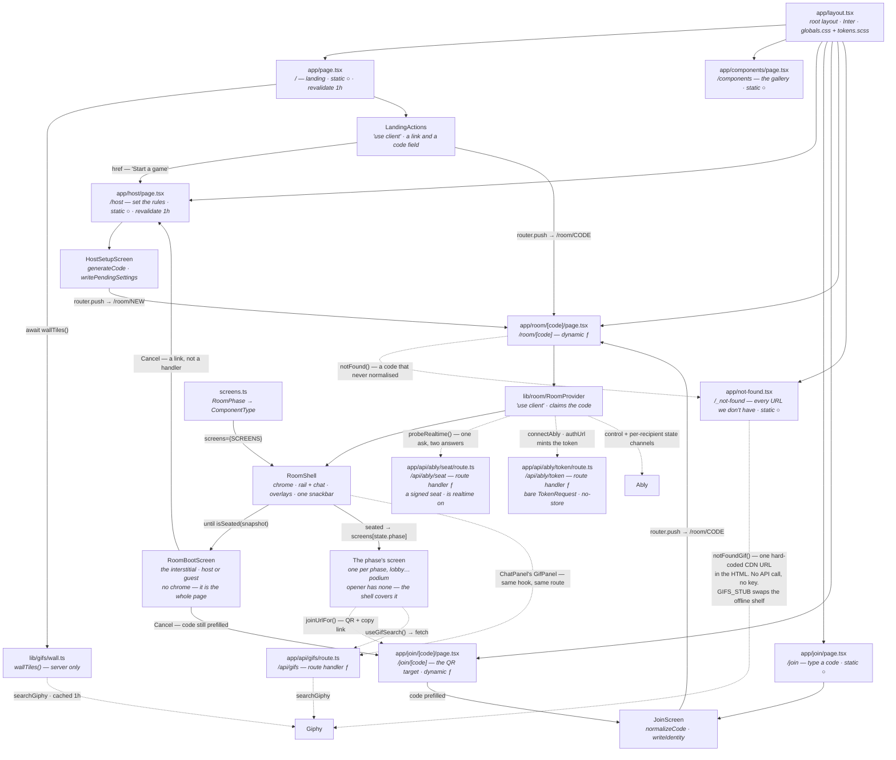

`/` is still the only page that reaches a third party from the server render;
every other Giphy *call* goes through the route handler. Both doors are the same
function, `searchGiphy()`, and the key stops at the server in both. The 404 is
neither door and that is why its arrow is dotted straight to Giphy: it makes no
call at all, in either place — it ships a URL and lets the browser fetch the
picture.

**`/` is the landing page from artboard 1a**, and it composes three things:
`LandingNav`, the hero copy, and `LandingActions`. It holds no markup of its
own beyond the headline, the lead and the avatar proof row — whose five faces
now carry the catalogue's first five seeds on the first five seat colours, so
the row is literally "here are five of the faces you can pick" rather than five
initials in circles. **Its two doors now
go to two different places.** "Start a game" is a link to `/host` — a
navigation, so it previews on hover and works before hydration — because that
is where the room's rules are chosen and where `generateCode` now lives. The
code field still pushes straight at `/room/[code]`, because a typed code is
already the answer to the only question a join screen asks.

**`/join` collects the three things a seat needs** — which room, what to call
you, which face — and `/join/[code]` is the same screen with the code
prefilled. **It is `/host`'s surface, field for field**: the three controls sit
on the same 600px card, the CTA is docked rather than floating in the flow, and
from `xl` the same `HeroWall` takes the 60% beside it. The two front doors are
one screen apart in a guest's session — a host reads a code out, a guest types
it in — and join was the only one of them that still looked like a form on a
bare canvas. Its dock carries *both* actions, which `/host`'s does not: a guest
who arrived before the host did needs "Make your own" to be as reachable as the
button they cannot press yet. That is the QR target and the link `RoomShare` copies. It is
deliberately not a redirect into the room: a guest arriving unnamed would be
seated as a stranger, and the nickname and face have to exist before
`RoomProvider` can ask for a place. Neither screen sends anything anywhere —
they write the person to `localStorage` and push, and the room reads it back.
A code that will not normalise is left in the field with `JOIN_ERRORS.malformed`
under it rather than 404ing, because on a screen whose whole job is that field,
correcting it is the point.

**`/host` is the only screen where a room's rules are decided**, and its
defaults are playable untouched. It is one column below `xl` and two above it:
the form holds its 600px either way, and the 60% beside it is `HeroWall` — the
landing page's own wall, at its `soft` scrim weight, which is the only thing on
a screen of toggles that says what the room is for. Below `xl` the wall is not
rendered at all rather than stacked under a form nobody scrolled to. The CTA
left the card and became the form column's docked action bar, sticky against
the page's scroll on a phone and against the column's own from `xl`, so "Open
the room" is never the thing you scroll two Steppers to find. The form column
is a *query container* — `.modes` reflows on the column's width, not the
window's, because a viewport query cannot see that 60% went to the wall — and
that containment is why `HelpModal` renders outside it: a query container is
the containing block for its `position: fixed` descendants.

On submit it writes the chosen `RoomSettings`
to `sessionStorage` through `lib/room/pendingSettings.ts`, generates a code and
pushes. The settings ride in storage rather than the query string: seven of them
would make an unreadable URL on a screen whose next act is reading a code out
loud, and they belong to the room this tab is opening rather than to the
browser. `RoomProvider` clears them on use, so a later room cannot inherit the
last host's rules.

Nothing asks a server for a code, because under
[ADR 0003](./adr/0003-host-authority-over-a-swappable-transport.md) there is no
server to ask: the host's browser is it, so a code only has to be well-formed
and unlikely to collide. `normalizeCode` folds the ambiguous **digits** as
well as the letters (`0→Q`, `1→J`, `2→4`, `5→3`), so a code read aloud down a
call survives whichever half of each pair the listener reaches for — and it is
the same function on all four doors: the landing field, `/join`, `/join/[code]`
and the room segment itself.

`/components` renders the reusable library in its states. It's the design
review surface and what `e2e/components.spec.ts` drives — the components are
verified against a real browser rather than a snapshot. `JoinPanel` lives here
now rather than on `/`, as does `QuickJoin` — and note that the gallery is the
*only* thing that renders `JoinPanel`: `/join` was built from `CodeEntry`,
`AvatarPicker` and `TextField`, because the design's join screen is a form with
a face on it rather than a panel. It is a spare part until something needs a
QR-and-code pair outside the lobby. The gap in it is the three
page-shaped landing components: `LandingNav` and `LandingActions` are
single-use, so `e2e/landing.spec.ts` covers them on the real page instead.
`HeroWall` no longer is — `/host` and `/join` render it too — but it is still
covered on its pages rather than in the gallery, because a wall of twenty tiles inside a
component grid is a demo of nothing.
Phase 3's two new atoms, `StatusPill` and `RankSlot`, are both in the gallery,
and so are phase 4's two new molecules, `AvatarPicker` and `ModeCard` — they are
shared by `/join` and `/host`, which is exactly why they are molecules and not
markup inside either screen.

**`RoomBootScreen` is the one organism the gallery renders**, at `#boot`, in
three states: a host, a guest, and a refused guest. It can be, because it reads
nothing — `RoomShell` owns the boot state and hands it finished props, so the
whole screen draws from a fixture with no transport near it. That is also where
the four checklist row states are asserted exhaustively, since on a live boot
the last row is done for the frame before the screen it is on hands over.

**`/room/[code]` is one route for the whole room; the phase is a render switch
inside it, not a URL.** A route per phase was rejected on purpose: transitions
are host-pushed and simultaneous for up to twenty clients, so each would be
twenty `router.push` calls that risk losing focus and scroll — and the back
button would become a time machine into a phase the room has already left. The
route is dynamic because it awaits `searchParams` (`params` and `searchParams`
are Promises in Next 16); the segment resolves through
`normalizeCode` or 404s, with `DEV` reserved as the harness room `C-DEV000`.

The room page reads the segment and hands off; `screens.ts` is the only place
that knows which component a phase renders, so `RoomShell` keeps no opinion
about what it wraps. **The map now covers all nine non-opener phases**, and
`PhasePending` — the stand-in the uncovered ones used to get — was deleted with
the last of them, along with the shell's `?? PhasePending` fallback. `Screen` is
now just `screens[state.phase]`, so a missing entry means the map is wrong
rather than the work is unfinished. `opener` is the one deliberate absence:
the shell draws its interstitial over the whole page, and a screen behind it
would be one nobody can see announcing itself.

**There is an eleventh thing that route can render, and it is not a phase.**
Before the room is this tab's, `RoomShell` returns `RoomBootScreen` instead of
its own chrome — no header, no rail, no `<main data-phase>` — so the whole page
is the interstitial and there is nothing behind it to be half-drawn. It is
deliberately not an entry in `screens.ts`: the map is keyed by `RoomPhase`, and
the boot is the state of *not having one yet*. The condition is
`!state || !timeline.settled`, and the first half of that is the old `!state`
guard kept only for SSR — what actually holds the screen up is
`isSeated(snapshot)`, read through `useBootTimeline`.

The phase is on the DOM as well as in state: `RoomShell` renders
`<main data-phase={state.phase}>`, and every room spec drives
`main[data-phase]` rather than guessing at copy. `reveal` and `score` are the
two phases that are untimed by design, so each of their screens carries the
host's own advance button — without it a room with no bots in it would stop
permanently, which `e2e/room.spec.ts` now asserts directly rather than assuming.

`/api/gifs` is the repo's first route handler, and the shape every later server
route copies: the client asks it, it asks the third party, the credential never
crosses. `searchGiphy()` in `lib/gifs/giphy.ts` is the only code that reads
`GIPHY_API_KEY`, it pins `rating=pg-13` unconditionally so the picker's "SFW
filter on" promise cannot be raised by a caller, and it gives up after 4s
because the brief clock is 30s and a hung request must not eat it. Three
different switches land on the same offline shelf — `GIFS_STUB=1`, the
`?gifs=stub` lever forwarded as `?stub=1`, and a missing key outside production
— and they are all resolved inside the route, so no screen has to know which
one is on. `source: 'sample'` comes back in the body and the picker says so.

**The two Ably routes are that route's siblings, and they are two rather than
one because Ably says so.** `/api/ably/token` is the SDK's `authUrl`, and an
`authUrl` must answer with the **bare `TokenRequest`** — Ably rejects an
envelope outright ("The returned object has neither a keyName nor an issued
field"), so the seat that would otherwise ride beside it lives at
`/api/ably/seat`. That is also where the stub switch lives: `ABLY_STUB=1`, or
`?stub=1` outside production, comes back as `stub: true` on the seat and the
room takes the tab bus. The token route has no stub branch at all — with no key
it is a 500, because a client that got that far is asking for something the
server cannot do.

They copy the Giphy route in every respect but caching: it sets `s-maxage`, and
the token route sets **`Cache-Control: no-store` with no `next: { revalidate }`
at all** — a minted token is the one
response in the app that must not be shared or replayed. `lib/ably/token.ts`
mints with `createTokenRequest`, which signs locally with the key, so the route
makes no network call of its own; the capability it grants is the glob
`captionist:<code>:*` rather than an enumerated channel list, because a room
with twenty per-recipient state channels would otherwise put twenty keys in
every token. The seat half is [below](#who-hosts).

`app/layout.tsx` is the only place fonts and global CSS are loaded. Inter is
pulled by `next/font/google` and exposed to Sass as the `--font-inter` custom
property, so no component ever declares a font family directly.

## Room state

Three layers in a stack, plus `lib/gifs/`, `lib/avatar.ts`, `lib/ably/`,
`lib/reactions.ts`, `lib/noto.ts` and `lib/recent-reactions.ts` alongside — and
the arrows only ever point one way. **State lives in `lib/`; `components/` is
UI.** Providers, stores and hooks belong in `lib/room/` even though they are
React — putting a provider in `components/` would make a tier that is supposed
to be about markup the owner of room authority instead.

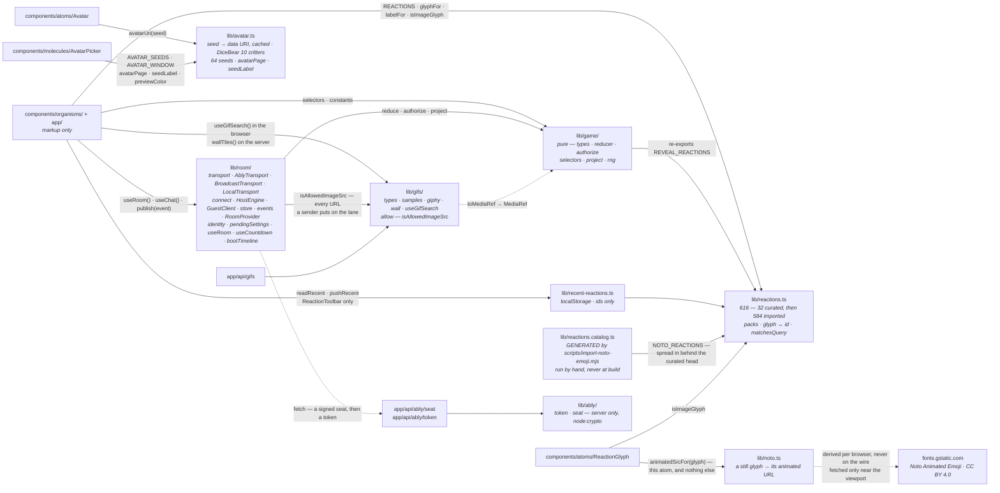

Every solid arrow is a dependency, and the dotted ones are runtime traffic
rather than imports — `lib/room/`'s is a fetch, which is the whole reason
`lib/ably/` can hold the key handling and still never reach a client bundle, and
`lib/noto.ts`'s is an `` each browser issues for itself, out of a URL it
derived locally. **No arrow points back.** Phase 6 briefly introduced one:
`lib/reactions.ts` took its `Reaction` shape as a type import from
`components/molecules/ReactionToolbar`, which —
because `lib/game/selectors.ts` re-exports `REVEAL_REACTIONS` — gave the pure
core a type edge into `components/`. Types are erased at build, so nothing was
breaking and the unit suite never noticed, which is exactly what makes that
class of drift worth catching in review. `Reaction` is declared in
`lib/reactions.ts` now and the toolbar imports it, so the shape and the list
live together on the side that owns them.

**Phase 7 added one arrow, `lib/room/` → `lib/gifs/`**, and it points the way
the others do. `events.ts` calls `isAllowedImageSrc` on every URL a sender puts
on the lane. The allowlist sits in `lib/gifs/` rather than beside the store
that calls it because it is a fact about where this app's pictures come from,
not about how a room talks — the same reasoning that put `GifResult` there
instead of in `components/`.

`lib/game/` imports nothing outside `lib/` — no React, no browser, no
transport. Phase 6 added its one exception and made it a re-export rather than a
copy: `selectors.ts` passes `REVEAL_REACTIONS` through from `lib/reactions.ts`,
so the reveal bar and the vote picker cannot drift apart. That is what makes
`npm run test:unit` a node-environment suite and
why `vitest.config.mts` scopes itself to `lib/**/*.test.ts`. A screen reads it
directly, but only through the pure half: `selectors.ts` and `constants.ts`,
never the reducer. **Every string and every branch on a screen comes from a
named selector** — `viewKey`, `briefCopy`, `phaseLabel`, `canStart`, phase
3's `waitingCopy` · `voteCopy` · `tiebreakCopy` · `revealCopy` · `scoreCopy` ·
`podiumCopy`, and phase 4's `joinCopy` · `JOIN_ERRORS` · `hostSetupCopy` ·
`modeChoices` · `showsCaptionFormat` · `settingsSummary` · `WAITING_LINE`, and
phase 5's `presentCount` · `seatState` · `seatSecondsLeft` · `reconnectCopy`, and
phase 7's `ballotFrom` · `captionFields` — so
the decision about what a phase means lives in a file a node test can reach, and
the screen is left holding markup. **One live exception, and it is phase 7's:**
`VoteScreen` reads `state.settings.voting` directly to choose between
`voteCopy`'s `clearAction` and a locally composed `Clear ${ordinal(place)}`. The
ballot shape it was originally read for is `ballotFrom`'s now, so what is left
is a copy branch that belongs in `voteCopy` beside the string it competes with.
The two pre-room screens use the same road
even though they have no state to read: `joinCopy()` and `hostSetupCopy()` take
no arguments and still live in `selectors.ts`, because copy is pure logic and
`lib/game/selectors.test.ts` is where the words are asserted. The mutable half
is reached only through `lib/room/`, and what a screen sees of that is
`useRoom()`, `useRoomRefusal()` and `useCountdown()` — plus `useBootTimeline()`,
which only the shell calls, because the only thing it decides is whether there
is a screen yet.

**The lobby is one screen with two faces**, and it is `lobbyCopy(state,
viewerId)` that decides which. A guest sees the settings as a read-only
`settingsSummary` instead of the mode control, the share block gated off, the
roster as wrapping name pills, and a headline answering the two questions a
waiting player actually has — am I in, and who is holding things up. Which is
also why `HOST_FALLBACK_NAME` exists: the host's default used to be `"You"`, so
a guest's lobby read "You is still herding the rest of the team".

The gate selectors are where that pays off twice. `lockGate` reads the
*committed* ballot, but `VoteScreen` ranks locally and has to label its button
against a draft the room has not seen — so both now call one function,
`lockGateFrom(state, viewerId, ranked)`, and the two labels cannot drift apart.
A "Pick 2 more" that disagreed with itself between the draft and the commit
would be the exact failure mode rule 10 (*blocked is not disabled*) exists to
prevent. That there are two ballots to reconcile at all is
[ADR 0006](./adr/0006-a-ballot-is-a-draft-until-it-is-locked.md)'s doing: the
ranking stays local until the lock, and exactly one `round/ballotCast` leaves
the screen.

**Phase 7 made two `RoomSettings` fields load-bearing that had been decorative
since `/host` shipped.** `voting: 'single'` and `format: 'one'` were live
controls no screen read: `ComposeScreen` never looked at `settings.format`, and
`VoteScreen` always cast `kind: 'rank'`, so a room whose own label promised one
point paid `RANK_POINTS[0]` — three. Four selectors close it, and all four are
values rather than forks. `captionFields(state)` returns one field or two, so
one compose screen draws both formats. `rankSlotCount` caps at 1 when the
setting says so, `voteCopy` carries the single-vote strings, and `voteCards`
treats a cast single ballot as a one-long ranking so a locked pick still wears
its ring. `ballotFrom(state, ranked)` is the fifth and the important one: two
callers build a ballot — the screen and `lib/game/fixtures.ts` — and both
hardcoded `kind: 'rank'`, so branching the values in one place is what stops
them drifting again. The floor under all of it is `authorize.ts`, which now
refuses a multi-entry rank ballot in a single-vote room: the mismatch was
reachable from any client, not only from the screen that happened to draw the
slots.

`lib/gifs/` is the second lib, and it sits beside the room rather than under it.
The route handler, the browser hook and now the landing page's server render all
import it, which is exactly why `GifResult` is declared there: a route reaching
into `components/` would be the wrong direction. `wall.ts` is the third caller
and the only server-side one outside a route handler — it turns `GifResult`s
into `WallTile`s, a smaller shape carrying just a poster, a motion source and
alt text, so `HeroWall` never sees a search result. `toMediaRef()` is the
one-way door between a search result and game state — `id` and `keywords` are dropped, because `MediaRef` has no id and
the room has no use for the terms that surfaced a GIF. `allow.ts` is phase 7's
addition and the fourth caller's supplier: `isAllowedImageSrc` is what
`lib/room/events.ts` runs every sender-supplied URL through. It belongs here
rather than beside the store for the same reason `GifResult` does — it is a
fact about where this app's pictures come from, not about how a room talks.

`lib/avatar.ts` is the third lib. **The art is derived at the edge and never
stored**: `avatarUri(seed)` renders a DiceBear `critters` face into a data URI,
memoised per seed so a twenty-player scoreboard does not rebuild every face on
every broadcast. `GameState` still carries only `avatarSeed`, which is invariant
1 at the top of `lib/game/types.ts` — twenty inlined avatars would exhaust
Ably's 64KB cap on their own. It is rendered as an ``, not
`dangerouslySetInnerHTML`: the seed arrives *from other players*, and an
`` is a passive context where an SVG cannot run script.

**The style changed because the catalogue did.** `AVATAR_SEEDS` grew from seven
to sixty-four, and seven flat emoji faces do not stay tellable apart sixty-four
times — `critters` is combinatorial (bodies, eyes, mouths, hats, patterns and a
palette apiece for body and accent), which is what makes a catalogue that size
readable at 26px, the smallest size the app draws one. The original seven keep
indices 0–6, so a seed already sitting in somebody's `localStorage` still
resolves and still lands on page 0. Two option values are load-bearing rather
than cosmetic: `backgroundColor: ['00000000']`, because 10 validates colours as
hex and critters paints an opaque background by default, so getting it wrong
covers every player's seat colour; and `animationVariant: 'none'`, pinned even
though the moving variants carry `weight: 0` upstream today, because that is a
value in a third party's JSON and motion inside an `` is motion nobody can
stop. `lib/avatar.test.ts` asserts both. The version 10 validators do reach the
browser — 34KB gzipped — which is measured rather than assumed, and is the
number that would decide a move to committed SVGs; the amendment to
[ADR 0008](./adr/0008-avatar-art-is-derived-at-the-edge.md) carries it.

Three exports beside `avatarUri` exist for the picker, and `avatarPage` is the
one that earns its place. It is **pure**: given a seed it returns the eight-face
page that seed sits on, so `AvatarPicker`'s opening window is derived from the
stored value on the server and in the browser alike and hydration has nothing to
disagree about. Drawing that first window at random — the obvious way to build a
shuffling picker — would be a mismatch on every load. `AVATAR_WINDOW` is the 8,
and sixty-four is eight of it exactly, so no page is ragged. `seedLabel` is how
a face gets announced: `sunfish` is "Sunfish", which is what replaced "Face 3"
as the picker's accessible name.
`lib/ably/` is the fourth, and the only one that never reaches the browser at
all: `token.ts` takes the key as an argument rather than reading it, the way
`searchGiphy(query, apiKey)` does, and `seat.ts` imports `node:crypto`, which
keeps it server-side by construction rather than by convention.
`lib/reactions.ts` is the fifth: the room's reactions in one deliberately
ordered list, their pack, and the glyph-to-id hop the wire needs. It moved out
of `ComponentGallery` in phase 6, where it had been fine until a second surface
needed it, and phase 7 grew it from ten to 32 — **including the four Slackmoji
tiles this file used to say were unbuildable.** That blocker belonged to user
uploads and got borrowed: Slackmoji are a *workspace's* own uploads with nowhere
to live, but these four are ours, authored as SVGs under `public/media/` beside the
24 sample tiles already there. The honest deviation left is that they are SVG
rather than animated GIF, which is the deviation `stub-*.svg` already makes.
Because a glyph can now be a location, three things follow: `isImageGlyph`
decides which, `ReactionGlyph` renders either without every caller growing the
same ternary, and `labelFor` gives an unknown location a generic name rather
than reading a path out character by character.

**It is 616 now, and the shape of the growth is the load-bearing part.** 584
came from Google's Noto Animated Emoji, imported by
`scripts/import-noto-emoji.mjs` into the generated `lib/reactions.catalog.ts`
and committed as still SVGs — the script is run by hand and deliberately not
wired into `build`, because the build has no network and 584 files that change
roughly never have no business being fetched on every deploy. `REACTIONS` is
`[...CURATED, ...NOTO_REACTIONS]` rather than one merged list, precisely so
every slice in the file still counts from the same front: the composer's six,
the reveal's five and the picker's default ten are the same reactions they were
at 32. Two indexes came with the size — `BY_ID` and `BY_GLYPH` replace what were
`REACTIONS.find` linear scans behind `glyphFor`, `idFor` and `labelFor`, and
`SEARCH_TEXT` behind the new `matchesQuery` replaces a lowercase-and-join the
picker was running 616 times per keystroke. `ReactionPack` gained `nature` and
`places`, because Noto's nine categories fold into four packs and the tab row
has room for six chips.

`lib/noto.ts` is the sixth, and it is one function for one reason: the art is
ours to serve and the motion is not. `animatedSrcFor(glyph)` matches
`/media/emoji/<codepoint>.svg` and nothing else, returning the
`fonts.gstatic.com` WebP for it and `null` for a Slackmoji or an emoji
character, both of which already move on their own terms. **It is derivation,
not a second field.** Nothing publishes an animated URL, nothing stores one, and
no sender can choose one — which is what let the allowlist stay a same-origin
rule with Giphy beside it.
[ADR 0012](./adr/0012-the-catalog-is-licensed-art-and-the-animation-is-borrowed.md)
records why the catalog is Noto rather than the slackmojis.com directory the ask
named, and why the stills are committed while the animation is fetched.
`lib/recent-reactions.ts` is the seventh and still the smallest — the picker's
Recent tab, on `localStorage`, storing ids so a retired tile disappears instead
of rendering as a dead URL. It is the only reaction state that never touches
the wire. `lib/useReducedMotion.ts` is the eighth and the only one that is a
hook: `useSyncExternalStore` over `matchMedia`, answering `true` on the server,
so `HeroWall` and `ReactionGlyph` read the preference the same way instead of
each keeping an effect that sets state from a media query.

`Avatar` fills its circle three ways in order — a resolved `src`, a rendered
`avatarSeed`, then the initial — and `avatarSeed` was added to the
`Pick<AvatarProps, …>` every player-rendering molecule takes, so
`<PlayerRow player={player} />` still typechecks with no adapter. That is
invariant 2, and it is why the widening was one line in each molecule. It grew
one prop with the picker: `decorative` drops the circle out of the
accessibility tree — `aria-hidden` instead of `role="img"` with a label —
for the case where a parent already names the player. The picker's face buttons
are that case, since a labelled `role="img"` inside a labelled `role="radio"`
announces the same creature twice.

**Who you are is split across two storages**, in `lib/room/identity.ts`. The
*person* — nickname and face — is `localStorage`, shared by every tab, so
filling it in once is enough. The *seat* — the player id — is `sessionStorage`,
minted once per tab and kept across that tab's reloads. Two tabs of one browser
are the two players phase 4 exists to seat, and an id they shared put them both
in the same chair: the host addressed its own broadcast to itself and the guest
waited forever on a room that thought it had already spoken. Per-tab also
survives a reload, which is what makes a seat reclaimable.
`lib/room/useStoredPerson.ts` reads the person through `useSyncExternalStore`
rather than an effect — storage is an external system the server cannot see, so
an effect would be both a cascading render and a hydration mismatch. The entry
screens layer what has been typed *over* that value rather than seeding state
from it, so a prefill arriving at hydration cannot clear a field somebody is
already using.

**The seat is signed as well as stored.** Ably makes `Intent.from` trustworthy
for free — a token minted with a `clientId` binds it, and the server rejects a
publish claiming another — but only if a client cannot ask for a token bearing
someone else's id, and this app has no session to derive one from. So
`/api/ably/token` mints the seat *and* HMACs it with the same key that signs the
token; the browser keeps both halves in `sessionStorage` and presents them to
renew, and a seat with no matching signature is refused and a fresh one issued.
The compare is `timingSafeEqual`, because a plain `===` on an HMAC leaks a
forgery one byte at a time. `lib/ably/seat.test.ts` covers it. It is not a
login: it identifies a seat, not a person, so it stops forgery rather than
sharing — the same line every other decision here draws.

### Who hosts

**A client does not know whether it is the host until it asks**, and there are
now two ways of asking — one per transport, with the same answer.

**On Ably it is presence, not a probe.** `connectAbly` enters presence with
`{ host: false }`, reads `presence.get()`, and if nobody is already hosting it
updates to `{ host: true }`, waits ~400ms (`settleMs`) and looks again. A probe
needs a timeout tuned to a network; presence is a fact Ably keeps, so the
question is only "is one of the members already the host". The race — two people
opening the same code in the same breath — resolves the way the claim did:
lowest `clientId` wins, both clients read the same set, and no round trip is
needed to agree. `role: 'host'` skips the election outright, which is what the
`?phase=` harness declares.

**On the tab bus it is still the claim probe.** `connectBroadcast` posts a
`claim` on the room's control channel and waits ~180ms; silence means the room
is ours, an answer carries a membership token and makes us a guest. The full
reasoning, including why two simultaneous claims need no second round trip, is
[ADR 0007](./adr/0007-the-first-tab-to-ask-owns-the-room.md); why presence
replaced it is
[ADR 0009](./adr/0009-the-room-crosses-the-network.md). The diagram below is the
tab bus; the Ably road is drawn in full under
[rendering path](#the-realtime-path).

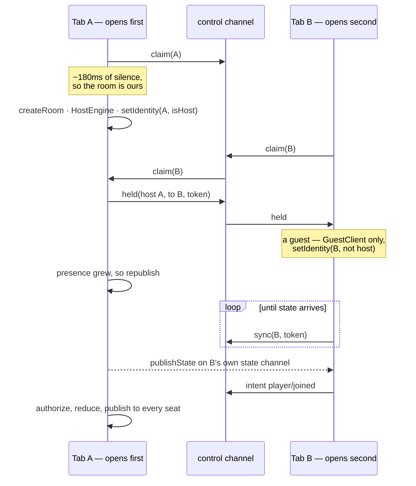

Two channel shapes, and the split is deliberate — the same split on both
transports. One **control** channel per room (`captionist:<code>` on the tab
bus, `captionist:<code>:control` on Ably) carries the room's talk: claim · held ·
beat · sync · bye on the tab bus, and `intent` · `event` · `refusal` on both,
with presence beside it. One **state** channel *per recipient*,
`captionist:<code>:state:<playerId>`, carries the projection. `project()` is per
viewer, so a shared payload with a `to` field would put every other player's
authorship into every tab's message handler — the exact leak
[ADR 0003](./adr/0003-host-authority-over-a-swappable-transport.md) says
devtools would defeat. Phase 5 inherited that answer rather than revisiting it,
which is what made the token's capability a glob: twenty per-recipient channels
would otherwise be twenty entries in every token.

Four things `AblyTransport` has to be careful about, and each is a line of code:
**`echoMessages: false`**, because the host's own loopback is explicit
([ADR 0004](./adr/0004-the-host-is-not-a-special-case.md)) and an echo would
apply every host action twice; **`message.clientId` *is* `Intent.from`**,
stamped by Ably from the token rather than taken from the payload, which is the
line the tab bus had to fake with a token table; **eight connection states map
to our three**, with `suspended` counted as disconnected rather than connecting
because it means continuity is already lost, and `'update'` ignored because it
is an event, not a state (`previous === current`); and **only
`message.action === 'message.create'` is a broadcast**, since Ably v2 messages
are mutable and an edit or a summary arrives on the same channel.

**`RoomProvider` asks the server one question before it asks the room
anything.** `probeRealtime(roomCode, seat)` in `lib/room/connect.ts` is a single
request that answers *is realtime configured* and *which seat may this tab be*
together, because they are the same fact: a server with no key cannot sign a
seat any more than it can mint a token, and asking twice would only give the two
answers a way to disagree. An unreachable route is treated as "no realtime"
rather than an error page. `transportKind(levers, stubbed)` then picks the road,
with the URL lever beating the environment — the same relationship `?gifs=stub`
has with `GIFS_STUB`. That module is the "one line in `RoomProvider`" the
roadmap promised, made a module so nothing upstream knows which road it got.

**`RoomProvider` branches on that one answer.** A host resolves its seat, builds
the engine, attaches bots and the autopilot under `?bots=`, listens for
`visibilitychange` to catch up a throttled tab, and sends `host/left` on
`beforeunload` — the room ends with its host, unchanged from
[ADR 0003](./adr/0003-host-authority-over-a-swappable-transport.md) and now
visible to other people. A guest builds only a `GuestClient` and sends
`player/left` on `beforeunload`, which holds a seat instead of ending a game it
does not own. `store.setIdentity(selfId, isHost)` is how the answer reaches the
store: `isHost` is no longer knowable at mount, so it starts `false` rather than
being a constructor argument. A tab that assumed otherwise would flash the
host's controls at a guest. A room that cannot be built at all — asking for
`?transport=ably` against a server with no key — ends at `store.setError`, and
the interstitial carries the sentence in place of its rail, because a page that
waits forever on a misconfigured server looks exactly like a slow one.

**That boot now reports itself, in four stamps and one seed.** `store.setBoot`
is a merging patch on `RoomSnapshot.boot`, and `RoomProvider` stamps it at the
milestones it was already passing: `probing` at mount, `claiming` once the seat
is signed, `waiting` once the claim answers, and `seating` on the one-shot ask
that sends `player/joined` or `player/reconnected`. Nothing is added to the
sequence to have something to show. The seed is the interesting half:
`intendedRole(seat)` decides which interstitial opens *before* anyone knows who
hosts, from the two signals already synchronous at mount — a `?phase=` fixture
declares itself the room, and a tab arriving from `/host` left its chosen
settings in `sessionStorage` on the way out. It **peeks** at those settings
rather than consuming them; `startAsHost` still owns clearing them, and
`RoomBootScreen`'s Cancel clears them too, so a host who backs out cannot hand
their rules to whatever room this tab opens next. The claim then overrides the
seed, including the case the seed cannot predict: a guest who typed a code
nobody was hosting and won the election.

**A refusal reaching a tab that has no seat yet is the other half.**
`transport.onRefusal` used to hand everything to `announce`, which is a
snackbar `RoomShell` only renders once it is past the boot branch — so a room
that would not have us said so into a component that was not on screen, and the
boot spun forever. The listener now checks `isSeated(store.getSnapshot())` and
routes an unseated refusal into `boot.failure` as well. Deliberately only there
and not in the in-process `announce` callback: that one is the host's own
mid-game refusals, and a host is never refused a seat in a room they just built.

**The guest's first ask is now two asks, and that is phase 5's bug fix.** It
still fires once on the first broadcast, but it asks for the right thing: not
listed at all → `player/joined`; listed but not `online` → `player/reconnected`.
The second branch never existed, and a held seat made its absence silent —
`player/left` keeps you in `players`, so the one-shot "am I listed" guard saw a
returning player as already handled and said nothing while the seat stayed
`reconnecting` forever.

Three things `BroadcastTransport` does that `LocalTransport` does not.
**It loops the sender back itself**, deferred, because `BroadcastChannel` never
delivers to the object that posted and the host's own actions travel the
transport by design ([ADR 0004](./adr/0004-the-host-is-not-a-special-case.md)).
**It stamps a membership token** on every intent and drops any mismatch, which
keeps `Intent.from`'s promise of an authenticated sender honest — same-origin
tabs are not a security boundary and this does not pretend to be one. That table
is exactly what `AblyTransport` deletes: a token binds the `clientId`, Ably
stamps it, and the doc comment on `Intent.from` is true there rather than
aspirational. **It runs a real status machine** —
`connecting → connected → disconnected`, driven by the heartbeat, where the
local bus could only ever say `connected`. The `role` option is how an endpoint
that already knows what it is skips the question: `auto` asks and lives with the
answer, which is every real room; `host` is the `?phase=` harness declaring
itself; `guest` is a bot or the `?as=` seat, which never promote themselves and
re-ask until the host in their own tab attaches.

`LocalTransport` is still the test bus, not a legacy path: `room.test.ts` drives
a virtual clock and `BroadcastChannel` will not answer to one. Its `onStatus` is
now a `Set` like every other subscription — as a single slot it silently evicted
a second subscriber. The tab transport's interesting behaviour only exists
across two real pages, so `e2e/twotabs.spec.ts` and `e2e/reconnect.spec.ts` are
where it is verified. **`AblyTransport` has no such spec, and cannot have one
here** — see [what is verified](#what-is-verified-and-what-is-not).

### Host authority

The host's browser is the server. One loop, in this order: **authorize → reduce
→ schedule → publish.** Nothing else may produce a `GameState`.

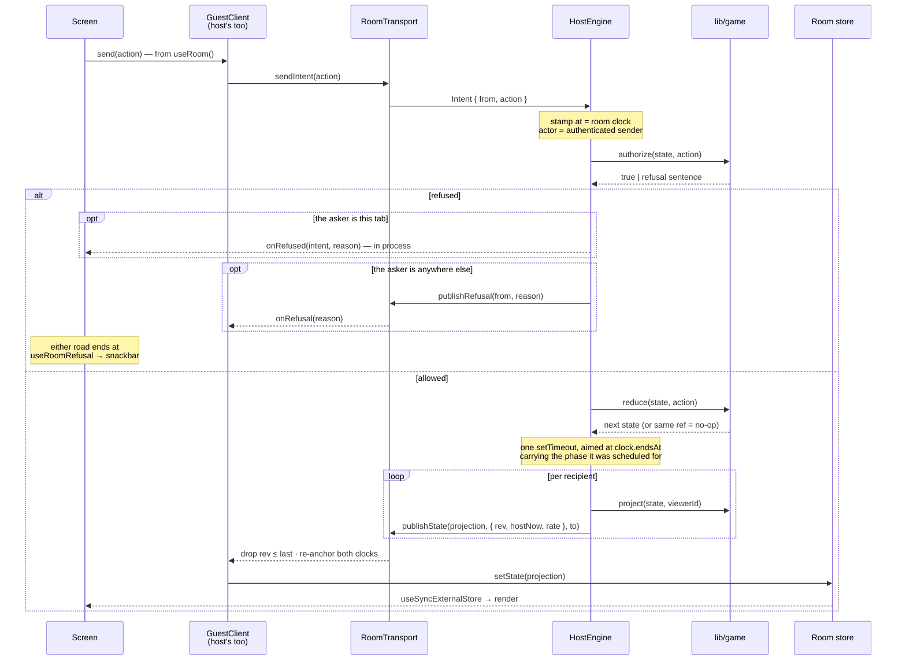

**Even the host's own actions take that road.** `RoomProvider.send` routes
through the local endpoint's `sendIntent`, not `engine.apply()` — going
straight into the engine skipped authorisation feedback, because `apply()` only
reports a refusal when it can name the intent behind it, so the local player's
refusals were dropped silently. The trip also costs the host the same
artificial latency a guest pays, which is the point: a screen that works here
works over a network — which phase 5 then demonstrated by changing nothing.
That decision, and the clock rate below, are recorded in
[ADR 0004](./adr/0004-the-host-is-not-a-special-case.md).

Seven details are load-bearing:

- **`at` and `actor` are the host's to decide**, never the sender's. `actor`
  comes from the transport's authenticated identity, so a guest cannot act as
  someone else by editing a payload — and the pure reducer never calls
  `Date.now()`.
- **`clock/expired` is refused off the wire.** It is the engine's own event;
  accepting one from a guest would let anybody end a phase early. It carries
  the phase it was scheduled for, so a late or duplicate fire is a reducer
  no-op and there is no cancellation bookkeeping.
- **Projection is per viewer, and it has to close every door at once.**
  Authorship is stripped from every entry but the viewer's own while voting is
  open, so the host publishes one payload per recipient rather than one
  broadcast. Anonymity is redaction, not restraint — every client holds the
  whole room. The second door is the tiebreak: it carries a `pending`
  `RoundResult`, and a `RoundResult` carries `authorOf`, a complete
  entry-to-author map for the *whole* round. Leaving that whole during
  `tiebreak` handed every client, by a second route, exactly the authorship
  `entry.authorId` had just been stripped of. `project()` narrows it to the two
  contenders rather than deleting it, because the duel is the one named screen
  before the reveal — a head-to-head cannot be anonymous, and the design puts
  both faces under the cards. `lib/game/project.test.ts` holds both doors shut.
  This is the one part of the interface a broadcast channel does not satisfy
  for free — [ADR 0003](./adr/0003-host-authority-over-a-swappable-transport.md)
  flagged it and deferred the choice, and phase 4 had to make it a phase early:
  **one channel per recipient**, `captionist:<code>:state:<playerId>`, rather
  than a shared payload with a `to` field. `AblyTransport` inherited it
  unchanged, opening each recipient's channel lazily as the roster grows.
- **`rev` orders; `hostNow` *and* `rate` sync.** Guests drop anything at or
  below the revision they last applied. A broadcast carries both where the
  host's clock was and how fast it is moving, and `GuestClient` anchors the
  pair — `hostAnchor`, `localAnchor`, `rate` — instead of storing a single skew
  offset. A lone offset is correct only at the instant it is measured: under
  `?fast=80` the host's deadline sits on a clock running 80× while the guest's
  advances at 1×, so between broadcasts the visible countdown stalled and then
  snapped. `roomNow()` now scales the elapsed local time, and the number moves
  smoothly in the gaps. `rate` is a property of the host's clock, so it rides in
  `StateMeta` and the domain never learns it exists.
- **A refusal is an event, not a value, and it has a lane on the wire.**
  `RoomTransport` carries `publishRefusal(to, reason)` / `onRefusal(handler)`,
  addressed and private — a refusal belongs to the person who asked, and
  broadcasting "Jesse cannot vote for their own" to the room would be both noise
  and a leak. `HostEngine.refuse()` fires the in-process callback *and*, when
  the asker is not the host's own endpoint, publishes over the transport; the
  host's own refusals stay in-process, because putting them on the wire as well
  would show them twice. `RoomProvider` still filters on `intent.from`, so a bot
  being told to sit a round out is the harness working rather than something to
  interrupt over. It arrives as a subscription rather than state, because
  re-rendering a refusal back into view later would be a lie, and `authorize.ts`
  returns finished sentences, so `RoomShell`'s handler is just the snackbar
  queue. This lane landed in phase 4, not phase 5: a second *tab* is already a
  genuinely remote guest, and without it a blocked button went quiet instead of
  explaining itself.
- **Presence drives the domain, and `HostEngine.reconcile()` is the bridge.**
  The transport knows sockets; the reducer knows seats; before phase 5 nothing
  joined the two, so the host detected a drop and did nothing with the
  knowledge — a vanished player stayed `online` in the roster forever and the
  held-seat machinery never ran. Every presence set is now reconciled against
  `state.players`: a member who is gone gets `player/left`, a member who is back
  gets `player/reconnected`, and the host itself is skipped because a host that
  dropped is not a case presence can report — the room went with it. It has to
  be idempotent, since a presence set arrives on every change, and it is: the
  reducer returns the same reference for a no-op, so reconciling an unchanged
  room costs nothing.
- **A member appearing has to trigger a publish.** `recipients()` already
  unioned `members()`, but nothing published when that set grew, so a guest
  attaching after `start()` waited on a broadcast that never came and never got
  off the boot interstitial. `HostEngine.start()` now republishes on
  `transport.onPresence`. It is safe to over-publish: a republish is idempotent
  and guests drop anything at or below the rev they hold. The guest re-asks
  (`sync`) on every heartbeat until state arrives, because the first publish
  after a claim can land before its inbox exists — self-healing rather than a
  race won by luck.

`LocalTransport` is deliberately asynchronous — ~80ms with jitter, and still a
microtask at zero latency. A synchronous local transport would have meant no
screen ever needed a pending state, and every submit path being rewritten the
day Ably landed. It landed, and none were.

### The event lane

**Two stores, and the second one is the point.** `RoomStore` holds what the host
published; `lib/room/events.ts` holds everything the room said that the reducer
never sees. Folding chat into `GameState` would have been an afternoon's
convenience and wrong twice over: the host broadcasts a per-viewer projection on
every revision, so a message would cost a full fan-out — and `rev` is the
ordering token guests drop stale *game* updates against, so chatter would bump
the number that decides whether a round update is still fresh. Both halves of
that — where a message lives, and who it is from — are [ADR 0010](./adr/0010-chat-is-a-second-store-and-its-sender-is-stamped.md).

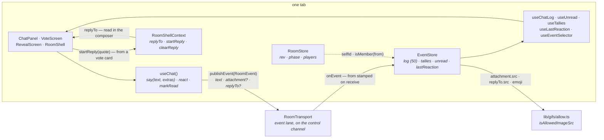

Nothing on that road touches `HostEngine`. An event carries no authority, so
there is nothing to authorize, nothing to reduce and nothing to schedule: the
host receives a message exactly as every guest does, through its own endpoint's
`onEvent`. The only thread back to room state is a pair of getters — who this
tab is, and whether a sender is in `state.players` — read live rather than
copied, so the store cannot hold a stale roster.

**The guards run where events arrive, not where they are sent.** A throttle on
the composer binds only the tab that agreed to run it, which is every tab except
the one worth throttling. So `receive()` holds all five:

- **Membership.** A sender who is not in the roster is dropped, on every
  transport — including the ones where identity is asserted rather than issued.
- **Rate.** 1.5s per sender, measured on the *local* clock. `at` is a number the
  sender chose, so a flooding tab would simply stamp its messages 1.5s apart and
  walk straight through a limit that read it. An attachment buys no second
  budget — one GIF per 1.5s is the same allowance as one line.
- **Length.** 140 characters, truncated rather than refused. A refusal for
  length is a snackbar nobody needs. `ATTACHMENT_ALT_MAX` is the same 140,
  `QUOTE_CAPTION_MAX` is 60, and `GLYPH_MAX` is 512 — enough for a tile's URL
  and not enough to put a 4KB string in `tallies` fifty times over.
- **Origin.** Every URL the lane carries clears `isAllowedImageSrc` — the
  attachment's `src`, the quote's thumbnail, and the reaction's glyph when it
  looks like a location rather than a character. This is phase 7's guard and
  the one the reaction lane had been missing since phase 6, silently, for as
  long as every glyph was an emoji.
- **Idempotence.** One reaction per person per emoji per target, so a repeat is
  a no-op and counts only ever rise. The design draws no un-react, and a count
  that could fall would need per-person state on every tally to know whose.
  **`room` is the exception, and pays for it.** DESIGNSYSTEM's "REACT TO THE
  ROOM" leaves no count — the design's own prototype fires floaters for it and
  stores nothing — so there is no tally to dedupe against and repeating it is
  the feature. That drops the guard the other two targets get for free, which
  is why it is the one target with a clock: `ROOM_REACTION_INTERVAL_MS`, 1.5s
  per sender, read off the local clock for the same reason chat's is.

**A bad source degrades a message; it never refuses one.** A disallowed
attachment is dropped and the words survive, a disallowed thumbnail is dropped
and the quoted caption survives, and only when nothing at all is left does the
message go — the same policy length already had. The pair that has to agree is
`receiveChat`'s "no text and no attachment" and `Composer.canSend`: **a GIF
alone is a complete message, a quote alone is not**, and if the two disagreed a
player would watch a message leave and never arrive.

**A quote is a snapshot, not a reference.** `ChatQuote` is `{ src?, caption }`
— no `EntryId`, and no authorship. Both omissions are load-bearing.
`round.entries` is replaced wholesale when the round turns over and nothing in
`history` keeps a caption's text, so an id would resolve to nothing by round
three, which is exactly when the design's reason for the quote ("keeps the
reply legible after the grid has scrolled") starts to matter — and resolving one
at render would make the event store read `PublicState`, which is the coupling
`isMember` is a predicate rather than a roster to avoid. Authorship is the
second door: `project()` strips `authorId` while voting is open, and a
"replying to Jesska's caption" label would hand it straight back, which is the
failure `redactTiebreak` already exists to prevent. Content is safe to copy
because every voter can already see it. Reasoned out in
[ADR 0011](./adr/0011-a-quote-is-a-copy-and-a-glyph-is-a-location.md).

**The staged reply is neither store's.** A quote is raised on a vote card and
consumed in the rail's composer, so it lives on `RoomShellContext` as
`replyTo` / `startReply` / `clearReply` — not in the event store, whose contract
is one event *off the wire* and this is unsent; not in `GameState`, which would
bump `rev`; not in storage. That is also why `RoomShell`'s provider now wraps
the rail as well as `<main>`: it previously wrapped only the content column, so
`ChatPanel` read the no-op context and every reply was staged into nothing.

**`from` is the transport's, never the payload's** — the rule `Intent.from` has
carried since phase 1, which the event lane only started keeping in phase 6.
`AblyTransport` reads `message.clientId`, stamped by Ably from the token;
`BroadcastTransport` takes the envelope's sender — checked against the roster
token when the host is the one receiving, since a guest cannot tell a member
from a forgery and pretending otherwise would be theatre; `LocalTransport`
stamps its own endpoint id. All three previously passed a
`RoomEvent`'s `from` through from the body, which was harmless while nothing
published events and "post as anyone in the room" the moment chat did. The
publish side stamps too, so a sender's own echo and everyone else's copy are the
same object.

The store obeys the same two constraints `RoomStore` does, for the same React 19
reasons: `getSnapshot()` returns a stable reference between real changes, and
nothing time-varying goes in it. Tallies are a `Record` keyed
`entry:<id>` / `message:<id>`, and only the key that moved is rebuilt — so
nineteen untouched vote cards keep their array identity and do not re-render.
A `room` reaction writes no key at all: it bumps `lastReaction` and returns, so
the burst is the whole of it.
`useEventSelector` is `useRoomSelector`'s twin over this store, with the same
double cache, and unlike its twin it has customers: `ChatPanel` and `VoteScreen`
each read the whole tally record in one subscription, because a per-row
`useTallies` would be a hook inside a list.

Unread is chat's only piece of local truth. It counts what arrived while the
rail was shut, remembers the first message of the run so `UnreadDivider` can sit
above it, and is cleared by *opening* chat — not by scrolling and not by time,
either of which would erase the line you came back to find. Your own message
never counts. `lastReaction` is an `{ emoji, key }` pair whose `key` rises on
every reaction including a repeat of the same emoji, which is what lets
`ReactionFloaters` fire twice for two 🔥 rather than once.

Chat is **not gated by phase**. The design draws it live through the vote with a
divider in the stream, and gating it would break the rail's always-docked
contract to solve a problem the round does not have — somebody writing a caption
is already not typing in chat. The vote grid's tallies are live for the same
reason they are safe: the ranking above them is local draft state until the lock
([ADR 0006](./adr/0006-a-ballot-is-a-draft-until-it-is-locked.md)), so an emoji
cannot herd a vote that has not been cast.

### The visible clock

`useCountdown(clock)` is the only thing that turns a deadline into a number on
screen, and it deliberately never touches the store. `store.ts` forbids anything
time-varying in the snapshot — `getSnapshot()` has to return a stable reference
or React 19 re-enters its render loop — so the countdown is local state driven
by an interval, and the arithmetic stays a pure function of `(clock, roomNow)`.
It takes the `Clock` as an argument rather than reading the room, which lets
`RoomShell` own the single interval serving the whole page. It ticks four times
a second, not once, because `?fast=80` lands a room-second every 12ms; it
re-renders only when a displayed second actually changes, and a paused or idle
clock gets no interval at all.

**The held seat is a deadline like any other**, so it gets the same hook: the
reconnect overlay's grace countdown is `useCountdown` over a `Clock` built from
`seatHeldUntil` and `SEAT_GRACE_MS`, rather than a second timer of its own. That
is also what keeps `Date.now()` out of the render path — `seatState(player,
now)` is a pure function, and the `now` it reads comes from the room clock.

### Dev levers

Ten now: `?seed=` · `?bots=` · `?fast=` · `?phase=` · `?mode=` · `?voting=` ·
`?format=` · `?as=` · `?gifs=` · `?transport=`, read once in `RoomProvider` and
gated to
non-production in `lib/room/levers.ts` — in a production build every lever reads
as absent whatever the query string says. **`?transport=ably|broadcast` is phase
5's**, and it stands to `ABLY_STUB` exactly as `?gifs=stub` stands to
`GIFS_STUB`: the URL wins, so one page load can be moved onto the tab bus
without restarting the server.

**`?voting=rank|single` and `?format=tb|one` are phase 7's, and they are
`?mode=`'s siblings** — the three now go through one helper,
`leverSettings(levers)`, which builds a `Partial<RoomSettings>` and hands it to
`createRoom` or the fixture. They exist for the same reason `?mode=` does:
every fixture takes `DEFAULT_SETTINGS`, so the only other road to a single-vote
or one-line room is `/host` → `sessionStorage` → a room, which drags a route
boundary into a screen spec. That is precisely why both settings survived four
phases doing nothing — nothing could reach them to cover them. **`?phase=` now also declares host-ness.** A
fixture *is* the room, so probing for one could only ever hand it to a stale
tab; the harness connects with `role: 'host'` and skips the claim, which is what
keeps every harness URL behaving exactly as it did before joining existed. That
is the only way the claim path could be added under a suite that guards
everything else. `?bots=` spawns guests *over the transport*, so
authorisation and ordering are exercised rather than bypassed; `?fast=` scales
the host's clock rather than the page's, because `page.clock` is per-page and
would desynchronise a room split across tabs. What each one is for is in
[the roadmap](./roadmap.md#the-url-levers).

**Both of those levers now reach the boot screen, and neither gained a
branch.** `?fast=` divides the interstitial's two pacing floors exactly as it
divides a round, so the harness URLs the suite opens over and over pay almost
nothing while a real room gets the pacing the design draws. `?phase=` turns the
pacing *off* — `pacedBoot` is `!seat.declared`, so a fixture, which is the room
rather than a boot of one, hands over on the frame it is ready. Walking a
fixture through three rows nobody asked for would be the invented stage that
screen exists not to have.

`?bots=` also attaches `lib/room/autopilot.ts`, which drives the transitions
that have no deadline — `lobby`, `reveal` and `score`. On the untimed two it now
**dwells** rather than advancing on the broadcast it just saw. That was
invisible while both phases were placeholders; against the real screens it
showed a winner for one frame. The dwell is 4s scaled by the clock rate
(`rate: levers.fast ?? 1`, so `?fast=80` still runs fast), guarded on
`${roundNumber}:${phase}` so a dwelling phase's repeat broadcasts queue one
timer rather than several, and it re-checks the phase before firing in case the
host skipped or a real button was tapped meanwhile. `dwellMs: 0` keeps the
advance synchronous — that is what `lib/room/room.test.ts` passes, because it
drives a virtual clock a real `setTimeout` would never reach. The dwell is
product behaviour, not protocol, which is why it lives in the harness and not
in `HostEngine`.

`?as=p2` is the structural one. It only means anything alongside `?phase=`,
because it takes a seat the fixture already populated. When it is set the local
endpoint stops being the host's own `GuestClient` on the host transport and
becomes a real guest — its own `connectBroadcast({ role: 'guest' })`, its own
seat — and the bot loop skips that id, since two drivers in one chair would
submit twice and vote against themselves. It was the first exercise of the guest
path, built before anything depended on it; the path it rehearsed is now the one
every real guest takes. Note what `isHost` means under it: this *tab* runs the
engine, but the *player* is a guest, so `store.setIdentity` is told
`seat.hostId === selfId` rather than "we built the engine" — offering p2 the
host's controls would only hand them a refusal.

## Component tiers

Tier is decided by dependencies, not size. Full rules in
[`components/README.md`](../components/README.md).

```mermaid
graph BT
  subgraph atoms["atoms/ — no app state, no component imports (Icon excepted)"]
    Layout["Stack · Inline · Box · Grid"]
    Icon["Icon"]
    Controls["Button · TextField · Toggle<br/>Stepper · SegmentedControl · Chip · RankSlot"]
    Status["TimerPill · TallyPill · PresencePill · StatusPill<br/>Tag · Eyebrow · RoundProgress<br/>ProgressRail · ProgressRing"]
    Ident["Avatar · RoomCode"]
    Brand["Logo<br/><i>the delivered SVG — header · landing · badge</i>"]
    Feedback["Snackbar · ReactionCTA"]
    Glyph["ReactionGlyph<br/><i>'use client' · a character, or the still —<br/>which upgrades to the animation</i>"]
  end
  subgraph molecules["molecules/ — compose atoms, and occasionally another molecule"]
    Room["JoinPanel · PlayerRow · PromptBanner"]
    Media["MediaCard"]
    Chat["ChatMessage · UnreadDivider<br/>ChatRail · ChatToast"]
    Overlay["HelpModal · RoundOpener · RoomToolbox<br/>ReactionToolbar · GifPanel<br/>ReconnectOverlay"]
    Dialog["Modal<br/><i>the stepped dialog — chrome and paging only</i>"]
    Compose["Composer · RevealReactionBar<br/>ReactionFloaters · AppHeader"]
    Lobby["CodeEntry · RoomShare · Podium"]
    Entry["AvatarPicker · ModeCard"]
    Landing["HeroWall · LandingNav · QuickJoin"]
    Boot["BootChecklist<br/><i>an ol — the order is the meaning</i>"]
    Mark["Wordmark<br/><i>the mark and the name — a molecule<br/>because it imports Logo, and Icon<br/>is the only atom exemption</i>"]
  end
  subgraph organisms["organisms/ — room state or routing"]
    Shell["RoomShell<br/>+ context (notify)"]
    BootScreen["RoomBootScreen<br/><i>a screen, and props only —<br/>no useRoom, no router</i>"]
    Panel["ChatPanel<br/><i>the rail's contents — neither a screen nor the shell</i>"]
    Screens["LobbyScreen · BriefScreen · ComposeScreen<br/>WaitingScreen · VoteScreen · TiebreakScreen<br/>RevealScreen · ScoreScreen · PodiumScreen"]
    Gallery["ComponentGallery"]
    Actions["LandingActions<br/><i>routes — no useRoom</i>"]
    EntryScreens["JoinScreen · HostSetupScreen<br/><i>route — no useRoom</i>"]
  end
  subgraph pages["app/ — composition only"]
    Home["page.tsx<br/><i>awaits wallTiles()</i>"]
    Comp["components/page.tsx"]
    JoinPage["join/page.tsx<br/>join/[code]/page.tsx"]
    HostPage["host/page.tsx"]
    RoomPage["room/[code]/page.tsx<br/>+ screens.ts"]
    NotFound["not-found.tsx<br/><i>markup in the route, like the landing's</i>"]
  end

  Icon --> Feedback
  Layout --> Room
  Ident --> Room
  Ident --> Chat
  Controls --> Overlay
  Feedback --> Chat
  Controls --> Landing
  Controls --> Actions
  Landing -->|"QuickJoin"| Actions
  Landing --> Home
  Actions --> Home
  Layout -->|"Stack"| Home
  Ident -->|"Avatar"| Home
  Ident -->|"Avatar — decorative, the button names the face"| Entry
  Status -->|"Tag"| Entry
  Controls -->|"Button — AvatarPicker's own<br/>'Shuffle faces', in its header"| Entry
  Controls -->|"Button · TextField · Stepper<br/>Toggle · SegmentedControl"| EntryScreens
  Entry -->|"AvatarPicker · ModeCard"| EntryScreens
  Lobby -->|"CodeEntry"| EntryScreens
  EntryScreens -->|"JoinScreen"| JoinPage
  EntryScreens -->|"HostSetupScreen"| HostPage
  Entry --> Gallery
  Room --> Gallery
  Media --> Gallery
  Chat -->|"all but ChatToast — it only exists<br/>over a collapsed rail"| Gallery
  Overlay -->|"all but ReconnectOverlay — it is fixed<br/>with no dismiss, so it would cover the page"| Gallery
  Compose --> Gallery
  Lobby --> Gallery
  Landing -->|"QuickJoin only"| Gallery
  Controls --> Compose
  Ident --> Lobby
  Brand -->|"Logo — the only atom Wordmark<br/>is allowed to reach for"| Mark
  Mark -->|"AppHeader — one lockup,<br/>drawn by all four surfaces"| Compose
  Mark -->|"LandingNav"| Landing
  BootScreen -->|"host · guest · refused —<br/>it reads nothing, so it fits"| Gallery
  Gallery --> Comp

  Layout -->|"Stack · Inline · Grid"| NotFound
  Controls -->|"Button href — both ways out are links"| NotFound
  Status -->|"Eyebrow · TallyPill"| NotFound
  Media -->|"MediaCard — the round nobody won"| NotFound
  Mark -->|"Wordmark — the fourth surface to draw it"| NotFound

  Chat -->|"ChatMessage · UnreadDivider"| Panel
  Compose -->|"Composer"| Panel
  Controls -->|"Button"| Dialog
  Icon --> Dialog
  Dialog -->|"HelpModal supplies steps and a mode switcher —<br/>a molecule inside a molecule, neither reaching a room"| Overlay
  Overlay -->|"ReactionToolbar — the picker is a popover<br/>GifPanel — the attach surface, same union"| Panel
  Status -->|"TallyPill"| Panel
  Glyph -->|"a tally's face"| Panel
  Glyph -->|"a tally's face"| Screens
  Glyph -->|"every tile in the picker,<br/>and the toolbox's react row"| Overlay
  Feedback -->|"ReactionCTA — the toolbox's<br/>own picker key"| Overlay
  Glyph -->|"the burst, and the reveal's one-tap row"| Compose
  Panel -->|"rendered as ChatRail's child"| Shell

  Icon -->|"check · close"| Boot
  Status -->|"ProgressRing — the active row's"| Boot
  Boot --> BootScreen
  Mark -->|"Wordmark — the third bar to draw it"| BootScreen
  Brand -->|"Logo — badge, inside the host's ring"| BootScreen
  Ident -->|"Avatar in the ring · RoomCode on the pill"| BootScreen
  Status -->|"ProgressRing — badge, round the mark or the face<br/>ProgressRail — tone accent"| BootScreen
  Controls -->|"Button href — Cancel is a link"| BootScreen
  BootScreen -->|"returned in place of the chrome,<br/>until isSeated()"| Shell

  Status -->|"TimerPill · RoundProgress · ProgressRail"| Shell
  Feedback --> Shell
  Chat -->|"ChatRail · ChatToast"| Shell
  Overlay -->|"HelpModal · RoundOpener · RoomToolbox — everyone's<br/>ReconnectOverlay — over a live room"| Shell
  Compose -->|"AppHeader · ReactionFloaters"| Shell
  Room -->|"PlayerRow · PromptBanner"| Screens
  Media --> Screens
  Overlay -->|"GifPanel · ReactionToolbar"| Screens
  Lobby -->|"RoomShare · Podium"| Screens
  Compose -->|"RevealReactionBar"| Screens
  Status -->|"StatusPill · Eyebrow · TallyPill"| Screens
  Feedback -->|"ReactionCTA — the vote grid's picker"| Screens
  Controls -->|"Button · RankSlot"| Screens
  Ident -->|"Avatar — the duel names both sides"| Screens
  Shell -.->|"RoomShellContext<br/>notify · openHelp · startReply"| Screens
  Shell -.->|"RoomShellContext.replyTo<br/>the staged quote, read in the composer"| Panel
  Shell --> RoomPage
  Screens -->|"SCREENS map in screens.ts"| RoomPage
```

`organisms/` is the tier that grew, and phase 3 is most of the growth: **nine
screens now, one per phase but `opener`.** An organism is anything that reaches
outside itself — room state or routing — which, not size, is why a
60-line `ScoreScreen` is one and a 218-line `GifPanel` is not. Until the landing
page every organism qualified on `useRoom()`; `LandingActions` was the first to
qualify on the other half of
[`components/README.md`](../components/README.md)'s rule, since it does no more
than take two clicks and `router.push`. **`JoinScreen` and `HostSetupScreen` are
the second and third, and they are the clearest case of it**: neither calls
`useRoom()` and neither can, because no room exists while they are on screen.
They collect what a seat needs, write it to storage and navigate — which is the
whole of the pre-room surface. `RoomShell` owns everything outside
the content column: the header and its trailing slot, the rail — docked or a
sheet — with `ChatPanel` inside it and chat's toasts beside it, the room
toolbox (everyone's, not just the host's), the help modal, the round-opener
overlay, the room-wide reaction floaters and one snackbar at a time. A
screen owns its content column and nothing else, which is what stops nine
screens each growing their own header. What a screen may ask of the chrome is
`RoomShellContext`, and it stays deliberately tiny: `notify()`, `openHelp()`,
and — since phase 7 — `startReply(quote)` with the `replyTo` it stages. The
reply belongs there by the same test as the other two: it is raised in the
content column and consumed in the rail, so it reaches outside the screen that
produced it. The context falls back to a no-op
rather than throwing, so a screen still renders on its own in the gallery or a
test — **which is exactly how the reply broke first.** The provider used to
wrap only `<main>`, so `ChatPanel` sat outside it, read the fallback, and every
staged quote went into a no-op. It now wraps the rail as well.

**The header's trailing slot holds one thing at a time**, and phase 3 gave it a
second occupant: `RoundProgress` on `score`, `TimerPill` everywhere a clock is
running. They share the slot rather than stacking because they can never both
apply — the scoreboard is untimed, and the timed phases have no rounds-played to
report. `showsRoundProgress(state)` is the selector that decides, so the branch
is a node test's rather than a stylesheet's.

The screens are injected, not imported: `RoomShell` takes a
`Partial<Record<RoomPhase, ComponentType>>`, and the map lives in
`app/room/[code]/screens.ts`. **`RoomShell` imports no screen at all now** —
deleting `PhasePending` deleted the last one, and with it the shell's only piece
of knowledge about what a phase looks like. `ChatPanel` is not a counter-example
even though the shell imports it directly: it is chrome, present in every phase
and keyed to none, so injecting it would be a slot with one occupant. The dotted
edge is the return path: the shell hands screens `notify()` through context.

`Stack`, `Inline`, `Box` and `Grid` are the layout primitives. They hold no
state and render no text, so they're atoms by the dependency rule — and they're
server components, so using them costs no client JS.

`Icon` is the one component atoms may import; the reasoning is in
[`components/README.md`](../components/README.md). Everything that takes user
input is `'use client'` and **controlled** — it owns no state, so the same
`Stepper` works in the setup screen and the room toolbox without either one
fighting it for ownership.

The landing components are the first tier placements decided by something
other than room state. `LandingNav` is a server component and a molecule
because it composes `Button` — and it is **not** a variant of `AppHeader`, which
is 88px of live room state redrawn on every broadcast. They share a wordmark and
nothing else, so a shared component would have each carrying props the other
never sets; that is the one case where the *variant is a prop* rule does not
apply. **The wordmark itself is shared now, which is that argument reaching its
own conclusion**: `Wordmark` is one component taking one `size`, both bars
render it, and the boot screen — which would have been the third inline copy of
the same lockup — is what made a shared component cheaper than a convention. It
is a **molecule**, not an atom, and the rule decided that rather than its size:
it imports `Logo`, and `Icon` is the only atom-to-atom exemption
[`components/README.md`](../components/README.md) grants. That also makes
`AppHeader` and `LandingNav` the second and third molecules to hold a molecule,
which the README now names.
`HeroWall` is `'use client'` only for the reduced-motion query and the
pause control — its markup still server-renders, which is what puts the whole
wall in the first HTML. **Its grid counts tracks rather than sizing tiles.** It
was `auto-fill` over a 300px minimum, which made the column count a function of
the window: at every width where the derived count did not divide twenty, the
last row came up short and the wall had a visible hole in it. It is
`repeat($wall-columns, minmax(0, 1fr))` by `$wall-rows` now — 4×5 on a phone,
5×4 from `md` up, the design's own landscape wall turned on its side for the
narrow case — so twenty tiles land in exactly twenty cells at every viewport.
`minmax(0, 1fr)` rather than a bare `1fr` because a bare one floors at the
content's minimum size and a track full of media would refuse to shrink to it.
`QuickJoin` is the landing page's own code field, and
the same call as `LandingNav`: `CodeEntry` is the whole screen for someone who
arrived to join, and shrinking it into a pill beside a headline would be two
layouts in one component rather than one prop. It borrows `CodeEntry`'s single
real input behind a masked display, and nothing else. `Button` gained an `href`
that renders a `next/link` wearing the button's classes, for the case where an
action is really a navigation: an anchor previews on hover, opens in a new tab
and works before hydration, none of which a `<button onClick>` does. "Start a
game" is now that case — it is a link to `/host` rather than a click handler
that mints a code.

Phase 4's two molecules are shared surfaces rather than screen internals, which
is the only reason they are molecules: `AvatarPicker` and `ModeCard` each appear
on both `/join` and `/host`, so leaving the markup inside either screen would
have been two copies to keep in step. `AvatarPicker` is also the first molecule
to import from `lib/` — `AVATAR_SEEDS`, `AVATAR_WINDOW`, `avatarPage`,
`seedLabel` and `previewColor` from `lib/avatar.ts`, a list and four pure
functions rather than room state, so the seed-to-preview-colour mapping exists
once and the two screens cannot drift. The catalogue lives there rather than in
`lib/room/` precisely so this molecule can read it without a molecule depending
on room authority.

**Sixty-four faces made it the one molecule that owns a control.** It draws a
window of eight with a `Shuffle faces` ghost `Button` in its own header, which
is why `Controls → Entry` is a new edge above; the same button used to sit in
`HostSetupScreen`'s nickname `trailing` slot, shuffling a picker it was not part
of, and `hostSetupCopy().shuffle` went with it. It is a real `role="radiogroup"`
now — `aria-labelledby` pointing at the visible label, so the `fieldset`/`legend`
that used to carry it is gone — with roving tabindex and arrow/Home/End keys,
which ship together because a group with one tab stop and no arrow keys is a
trap. Two invariants hold the shuffle honest: your own face is never shuffled
out from under you, and it is reinserted at the *position* it already held,
because `previewColor` is indexed by position and moving it would change the
colour under your pick. Everything else that grew was a prop, per rule 2:
`TextField` gained `error`, `StatusPill` gained `waiting` (a pulsing amber dot),
and `PlayerRow` gained a `pill` variant and a `you` flag for the guest lobby's
wrapping name pills.

**Phase 5 added exactly one component, `ReconnectOverlay`, and grew two.** It is
a molecule because it takes props and nothing else — `RoomShell` reads the room
and hands it finished strings from `reconnectCopy(state, viewerId, secondsLeft,
held)` — but it is the one molecule *not* in the gallery: it is `position:
fixed` with no dismiss, so rendering it there would cover the page.
`e2e/reconnect.spec.ts` covers it against a real room instead. The two that grew
did so as props, per rule 2: `ProgressRail` gained `size: 'header' | 'bar'`, and
`Icon` gained `wifiOff`. **Two things the design draws are deliberately absent**,
and for one reason: its `Reconnecting… attempt 3` shows no number, because the
transport retries internally and reports no count, so a figure would be invented
from a timer; and the 60-second bar renders only when a seat is genuinely held,
because the seat is held by the *host* and when the host is what vanished there
is no deadline to count. Both are the rule that dropped the reveal's
`auto-advancing in 6s` — a label with nothing behind it is worse than none.
`podiumCopy` grew the same way rather than forking: a room that ended early
lands on the podium with `The host left` above the standings and a link to
`/host`, because a room with no host has nothing to restart.

**Phase 6 added two components and moved one list.** `ChatToast` is a molecule —
an author, a line, no room state — and deliberately not a `Snackbar` variant:
the snackbar is the room's single centred voice for something *you* just did and
carries no author, while a toast is somebody else talking and stacks.
`ChatPanel` is an organism because it composes five molecules (four until phase
7 added `GifPanel`) and reads the
room, and it is the first organism that is neither a screen nor the shell.
`RoomShell` renders it as `ChatRail`'s child, so the rail stays a container with
no idea what a message is — which is exactly what lets **one rail serve both
breakpoints**. Below `md` the same markup is a sheet over the content and the
strip becomes a single key above the thumb; the branch is entirely in
`ChatRail.module.scss`. A sibling `ChatSheet` was the obvious shape and the
wrong one: header, stream and composer are identical at both sizes, so it would
have been a copy that drifts. `REACTIONS` left `ComponentGallery` for
`lib/reactions.ts`, because a list the gallery owned was a quiet source of drift
the moment the picker, the composer row and the reveal bar all needed it.

Everything else phase 6 needed was a prop, per rule 2. `ChatRail` gained a
`toasts` slot — what a toast looks like is chat's business, where it sits is the
rail's. `MediaCard` gained a `reaction` slot beside `action`, because the design
draws label, action and reaction as three things sharing one row and `action`
was already spoken for by the rank button. And `RoomShell` gained a
`--room-dock-bottom` custom property so floating furniture stacks rather than
collides: on a phone the toolbox key owns the bottom-right corner, so chat's
key starts a tap-target above it, and above `md` both revert because a docked
rail and the toolbox never contend. That offset used to depend on being the
host — `hasToolbox` was a conditional class — and is unconditional now, because
everyone has a toolbox. The other half of that collision is
behavioural — while the chat sheet is open on a phone the toolbox stands down,
since a fixed key over a sheet would land on the sheet's own send button. Both
offsets are built out of tokens (`$space-20`, `$tap-target-min`) inside
`RoomShell.module.scss`, and like the rail's two widths the decision is CSS's
because it changes at a breakpoint — React never sees the number.

**Phase 7 added exactly one component, and it is an atom: `ReactionGlyph`.**
It takes one glyph string and renders a character or an ``, which sounds
like a ternary until you count the callers — the vote grid's tallies, the
reveal's and chat's, three places that had each grown the same branch and any
one of which could forget it and print a URL as text. Which is what all three
did before it existed. It is an atom because it takes a string and reads
nothing, and it is decorative on purpose: `TallyPill` already hides its glyph
from screen readers and carries the reaction's name in its own visually-hidden
label, so a second accessible name here would be a stutter.

**The catalog import changed that atom more than anything else in the tree.**
It is `'use client'` now, because it owns the one decision the committed still
cannot make for itself: whether to reach for the animation. Three conditions,
all of which must hold — the tile is near the viewport (an
`IntersectionObserver`, since a pack is 60 tiles and each animation is ~369KB),
the browser has not asked for less motion (`useReducedMotion`), and the file
actually decodes (preloaded through `new Image()` and swapped into `src` only
on `onload`, so a slow or blocked network shows a still emoji rather than a
blank square). Which animation it has loaded is stamped with the glyph rather
than held as a boolean, so a change of reaction falls back to its own still by
derivation. It is still an atom by
[`components/README.md`](../components/README.md)'s rule — no app state, no
component imports — though it now imports three `lib/` modules where it
imported one, which is the honest reading of that rule: it is about
`components/`, not about `lib/`.

**Two more surfaces render through it than did before, and neither had a branch
to forget.** `ReactionFloaters` put `{f.glyph}` on screen as text, so a
Slackmoji burst printed `/media/slackmoji-lgtm.svg` up the page in 30px type;
`RevealReactionBar` did the same with its five one-tap keys, which are a slice
of a list whose first six are only *asserted* to be characters.
`ReactionToolbar` was the third, and it had a branch — its own copy of the
atom's — which is what the atom exists to delete. All three go through
`ReactionGlyph` now, which is also how the animated upgrade reaches the
picker's tiles without the picker knowing a CDN exists.

Everything else phase 7 needed was a prop or a slot, per rule 2. `MediaCard`
gained a `reply` slot beside `reaction` — **the design draws no reply control**,
only the message that results from one (Screens 2c), so the affordance is ours
and it goes where the foot's other peers already sit rather than nesting inside
`action`, which the rank button owns. `ChatMessage` gained `replyTo` and draws
the quote block after the body; `Composer` gained `replyTo` / `onClearReply`
and a strip above the field. `ReactionToolbar` grew pack tabs — Recent ·
Slackmojis · Smileys · Nature · Objects · Places, six chips in a row that
scrolls sideways rather than wrapping, so the panel keeps its height whatever is
in it — over a named `role="group"` tile grid, with a search that beats a tab
and a tab that beats the default six-plus-four, and an empty state for a Recent
nobody has filled yet. The tabs are a group of toggles and deliberately not a
`tablist`: a real one promises arrow-key navigation the grid below it does not
implement. **A pack now renders 60 tiles and extends on scroll**, through a
sentinel the grid itself observes; it used to render whole, which was right at
fourteen tiles and is a stall at 238. How far a view has been paged is stamped
with the view it belongs to, so switching tab or typing starts from the top by
derivation rather than by a render-then-correct.

`ReactionToolbar` is also the second molecule to import from `lib/` —
`AvatarPicker` was the first — and for the same reason: `REACTIONS` and
`readRecent`/`pushRecent` are a list and two storage functions rather than room
state, so a molecule reading them keeps the picker in step with the wire
without becoming an organism. `ChatPanel` is the phase's other structural
change and it stayed the same size: its boolean "is the picker open" became a
`Surface = 'reactions' | 'gifs' | null` union, so "one surface at a time" holds
by construction rather than by two booleans agreeing. The staged attachment is
deliberately *not* a member of that union — it is a pending payload that has to
survive the panel that produced it closing, which is the same shape one level
up as the staged reply on `RoomShellContext`.

**The toolbox pass added no component and renamed one.** `HostToolbox` became
`RoomToolbox` and widened rather than forking: the host's seven controls moved
behind one optional `host` prop, which is rule 2 applied to a whole section
rather than to a single value — a `GuestToolbox` would have been a copy of the
frame, the FAB, the rail offset and the walkthrough button, differing only in
what it omits. What it gained above that prop is the "React to the room" row,
six one-tap keys and a `ReactionCTA` opening the full picker *inside* the body
rather than over it, because the toolbox is already the open surface and a
popover hung off it would be a second one. The collapsed FAB renders both
shapes and lets CSS choose — a 44px key on a phone, where the corner is one
column wide and chat's key stacks directly above, and a labelled pill from `md`
up. That is `ChatRail`'s two-glyph trick applied to a whole label.

**It is also the repo's first molecule that imports another molecule.**
`RoomToolbox` holds `ReactionToolbar`, which `components/README.md`'s table
permits by omission rather than by intent: it forbids data fetching, realtime
and routing in a molecule, and says nothing about depth. The alternative was to
promote one of them to an organism, which would be a tier decided by nesting
instead of by dependency — the exact thing that table exists to prevent. Worth
knowing because it is the only one; if a second appears, the rule needs writing
down rather than inferring.

**`ReactionToolbar` became controlled so it could leave.** `open` is a prop
now rather than the caller mounting and unmounting it, because a panel that
animates *out* has to outlive the decision to close it; it unmounts itself once
the exit has run, on a timer rather than `animationend`, since
`prefers-reduced-motion` removes the animation and with it the event. It also
gained `onDismiss` — Escape and click-outside, owned by the panel because the
panel is what knows where its own edges are; without it the picker was a trap
that only the CTA that opened it could close. And it stopped printing its
`title`, which is now the accessible name only: you open it from the thing you
are reacting to, so the heading spent a line restating the last tap.

**The docked room is an app shell, and that is a layout change with a
behavioural cause.** `RoomShell`'s `.shell` is `height: 100dvh; overflow:
hidden` from `md` up and `.content` is the only thing that scrolls, so
`ChatRail`'s docked rail and collapsed strip are `position: static` full-height
flex children rather than `sticky` boxes measured at `100dvh`. Sticky plus a
viewport height inside a scrolling *page* put the composer below the fold until
the header had been scrolled away, which is a rail you have to scroll to reach.
Below `md` none of it applies: the rail is a sheet, and a phone's page is meant
to scroll.

`ChatPanel`'s composer emoji changed meaning rather than shape. They used to
fire a room burst and leave nothing in the log, aimed at whichever message
arrived last — so the same key meant "tally that" or "shout at the room"
depending on timing nobody could see. They post now, and the burst rides along:
`say(glyph)` plus `react('room', ROOM_TARGET, glyph)`, one wire event each, the
event lane unchanged.

**The boot screen added three components and grew three, and the split is the
usual one.** New: `ProgressRing` as an atom, `Wordmark` and `BootChecklist` as
molecules. Grown, per rule 2: `ProgressRail` gained `tone='accent'` (the boot
rail measures work rather than time, so it also drops the countdown's
one-second sweep, which would still be catching up when the room opened),
`RoomCode` gained `size='pill'`, `Logo` gained `size='badge'`. `ProgressRing` is
deliberately not a prop on `Avatar`: the host's boot rings the app's mark rather
than a face, so a ring that could only wrap an avatar would be half a
component — it takes `children` and knows nothing about them, which is also what
lets the checklist reuse it at 16px in place of a check.

**One of those placements bends `components/README.md`'s table and one only
looked like it did, and the difference is worth naming rather than leaving to
be rediscovered.** `Wordmark` reads as an atom — two elements, one prop, no
state — and it is filed as a **molecule**, because it imports `Logo` and the
table's exemption is `Icon` alone. Widening that exemption to "any leaf that
renders one `<svg>`" was the tempting edit and would have cost the rule its
edge, so the component moved instead of the rule. What follows is only that
`AppHeader` and `LandingNav` now hold a molecule apiece, which is depth rather
than a tier break: neither fetches, subscribes or routes.
`RoomBootScreen` is the case that really bends it — an organism that calls
neither `useRoom()` nor a router. It takes the boot as props, which is what puts
it in the gallery. It is filed by what it *is* — a full-page screen, the
eleventh thing `/room/[code]` can render — rather than by what it depends on,
which is the one axis that table says decides a tier. The alternative was a
molecule holding a `<h1>` and the page's only wordmark, which would make the
tier say less. If a second such case appears, the table needs an edit rather
than a footnote here.

**The 404 added a page and no component, and three components changed without
gaining a prop.** `app/not-found.tsx` composes `Grid`, `Stack`, `Inline`,
`Eyebrow`, two `Button href`s, `Wordmark`, `MediaCard` and two `TallyPill`s, and
holds its own markup for the reason the landing does — one page, so
`e2e/not-found.spec.ts` covers it rather than the gallery. The three that
changed did so **in their stylesheets**, which is the case rule 2 does not
reach: a variant is a prop, but a component being the wrong *shape* everywhere
is a fix rather than a variant. `MediaCard`'s frame is square at every width and
a query container, so the caption sizes against the card; `TallyPill` is
`ReactionCTA`'s 32px, because a reaction four people left should not read as a
footnote to the control offering a fifth, and it sizes an image glyph in `em` so
a Slackmoji and a character land the same size without a call site passing one;
`QuickJoin`'s field takes the slack with `flex: 1 0 auto`, so the key sits on
the pill's right edge wherever the pill is wider than its contents. None of the
three needed a caller to know.

**`GifPanel` is the fourth and the interesting one, because it changed layout
model rather than metrics.** Both of its variants — the `popover` in chat and
the `board` on the brief — are CSS `columns` now instead of `grid`, since a grid
row is as tall as its tallest cell and ragged GIF heights leave a hole under
every short one. Two costs are stated rather than discovered: reading order
becomes column-major (tab order still follows the DOM), and the popover's
scroller had to become a **wrapper** around the columns, because a multicol box
with a capped height treats that height as its fragmentainer and lays the rest
out sideways off the panel.

## Token flow

Values exist exactly once. Sass owns them; React reads them by name.

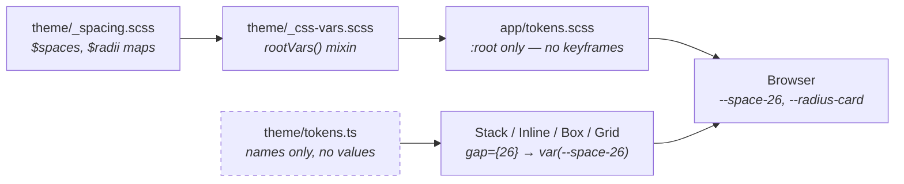

`theme/tokens.ts` contains no numbers — only the legal token names and the
`var()` references built from them. So `gap={13}` is a type error (13px isn't in
the design), and changing a value stays a one-line edit in Sass.
`e2e/tokens.spec.ts` asserts the bridge reaches the browser: if it breaks, every
gap silently falls back to `0` and no other test would fail.

`theme/_metrics.scss` is the other half of the picture and deliberately *not* on
that road: fixed sizes the design names once and only a stylesheet ever needs —
`$duel-card-width`, `$reveal-winner-width` and `$reveal-column-width` are phase
3's three, `$setup-column-width` is phase 4's one — the 600px card `/host` and
`/join` are both built on,
`$reconnect-card-width` is phase 5's one, the hero wall's
`$wall-columns` · `$wall-rows` · `$wall-columns-md` · `$wall-rows-md` are four
that replaced the `$wall-tile`/`$wall-tile-height` pair — a *count* rather than
a size, which is the whole reason the wall is always full, and they are coupled
to `WALL_SIZE` in `lib/gifs/wall.ts` in the one direction a stylesheet cannot
enforce, so both files say so. Phase 7 added six: the quote
block's `$chat-quote-radius` · `$chat-quote-rule` · `$chat-quote-thumb` ·
`$chat-quote-thumb-radius`, and the picker tab's `$reaction-tab-pad-y` ·
`$reaction-tab-pad-x`. The tab padding is 6px and 11px, which is off the
spacing scale on purpose — rule 4 says the scale is the uneven set the design
specifies, so the answer to a value the design draws and the scale does not hold
is a named metric, never the nearest token. The overlay's other
three values went to the maps they belong in rather than into the component:
`$urgent-border` and `$urgent-glow` are colours, `$z-reconnect: 92` is an
elevation, and it sits above every other overlay because when the room is gone
nothing else matters. The toolbox pass added one more, `$toolbox-fab-clear`:
160px a full-width control has to leave beside the collapsed toolbox from `md`
up, where the FAB is a labelled pill rather than a 44px key. `VoteScreen`'s
lock button is the one that needs it — it runs the width of the column, and its
right end was under the pill. The metrics stay Sass constants because no React
prop takes them, so
publishing a custom property for each would be a bridge with nothing crossing
it. The rule is the same either way: the number exists once, in `theme/`.

**This pass put ten names into that file and took five out, and the interesting
part is that the new ones are mostly not lengths.** Out: `$media-height` and
`$media-height-lg`, `$gif-panel-tile-height`, `$gif-board-tile`, and
`$tally-pad-y`. In: `$media-ratio: 1 / 1` and `$gif-tile-ratio: 5 / 4`, which
are *shapes*; `$media-overlay-size`, a `clamp(1.375rem, 8cqw, 2.625rem)` whose
middle term is container-relative, which is the whole reason `MediaCard`'s frame
declares `container-type: inline-size`; `$media-overlay-shadow`, `$tally-height`
· `$tally-glyph` · `$tally-count` (the two `$tally-pad-x` values stayed and were
redrawn around the new height), `$gif-panel-scroll-cap`
(320px, its own value rather than the `$toolbar-scroll-cap` it used to borrow
from the reaction toolbar, because a tile can now be as tall as its column is
wide), and the 404's own two page measures, `$notfound-width` and
`$notfound-lead-width` — one-offs that belong to a page rather than to any
component on it, exactly as `$landing-*` do. A height is right at one width; a
ratio is right at all of them, which is why swapping the media card back is one
line and why `$gif-tile-ratio` can be the fallback for a GIF that reports no
dimensions of its own.

**`theme/_typography.scss` gained a mixin, and it is not on the token bridge at
all.** `displaySmallText` is the ramp one step below the hero's — 42→68px, the
prototype's `42/5.6vw/68` — derived from the same 360→1440 anchors as
`displayText` rather than shrunk from it. Its only call site is the 404's
headline, because at the hero's 98px ceiling that headline took four lines
beside a card and read as a shout rather than a joke.
[design-system.md §1](./design-system.md) records that the prototype carries
five ramps and that the guide's single row is a lossy summary of them; this is
the second of the five to exist in code. Type mixins never cross into
`theme/tokens.ts` — nothing in React takes a font size as a prop — so the rule
that holds here is the plainer half: the numbers exist once, in `theme/`.

**`theme/_motion.scss` stopped being one mixin and became six.** There is no
`keyframes()` any more and `app/tokens.scss` includes nothing from it: each
animation is its own mixin — `popKeyframes` · `pulseKeyframes` ·
`riseKeyframes` · `caretKeyframes` · `toastinKeyframes` · `genieKeyframes` —
and the `.module.scss` that names the animation includes it directly under its
`@use 'theme' as t;`. This is the one place in `theme/` where a value is
*emitted* more than once on purpose: CSS Modules rewrite `animation-name` into
module scope exactly as they rewrite class names, so a rule referencing a
globally-declared keyframe asks for a name nothing declares and the browser
applies no animation at all — silently, because an unresolvable
`animation-name` is legal CSS. Five animations were dead that way, and the only
visible one was `rise`, which is the whole of the room's reaction burst. The
values still live once, in `theme/`; what is duplicated is emitted bytes.
[ADR 0013](./adr/0013-a-keyframe-is-scoped-to-the-module-that-names-it.md).
`genieKeyframes` is the first animation written against that rule, and it
carries its direction in a `--genie-shift` custom property rather than a second
pair of keyframes, because a custom property crosses the module boundary a
keyframe name does not.

The chat rail's two widths are the metric that does have to cross —
`rootVars()` publishes
`--rail-width` and `--rail-width-collapsed`, `RoomShell.module.scss` picks
between them and 0 at the breakpoints as `--room-rail-width`, and
`RoomToolbox` takes that custom property through its `railWidth` prop (widened
from `number` to `number | string` for exactly this). The offset has to survive
a media query, so it is decided in CSS; React only passes the name along. This
is the exception that proves the rule about layout values: it is in `theme/`,
not inlined, and no component owns a second copy of the number.

**Phase 6 added no metric and no elevation**, which is the best evidence the
ladder was drawn right the first time. `theme/_elevation.scss` already had
`$z-rail: 40` under `$z-toolbox: 50` under `$z-toast: 65`, then
`$z-reaction-picker: 70` and `$z-floater: 75` — so a toast rises above the rail
it came from, a picker opens over both, and the emoji burst crosses everything
below the interstitial. The one new name is `--room-dock-bottom`, and it holds a
`calc()` over existing spacing tokens rather than a number, for the same reason
`--room-rail-width` does: how far up from the bottom edge floating furniture
starts changes at `md`, and a media query is not something React can answer.

**Phase 7 added four colours and no elevation**, and the four are surface
rather than structure: `$surface-tab-active` for the picker's selected pack tab,
and `$fill-quote` · `$text-quote` · `$accent-border-quote` for the quoted
caption. The quote's rule is deliberately heavier than `$accent-border-strong`
rather than reusing it — the design distinguishes a rule that *marks* something
from one that edges a surface, and beside 14px body text the two are not
interchangeable. Nothing new opened over anything, so the ladder is untouched
for a second phase running — and for a third, since the toolbox pass moved the
room's picker *inside* `$z-toolbox: 50` rather than opening a new layer, and
`$z-reaction-picker: 70` still belongs to the two pickers that really are
popovers (the vote card's and the composer's).

## Rendering path

Five shapes, across ten routes. The simple one is prerendered HTML with
hydration reaching only the `'use client'` islands inside it — `/components`,
`/host`, `/join`, and now `/_not-found`, which is the thinnest example the app
has: every piece of it is a Server Component except `Button`, so the only thing
hydration reaches are two links wearing a button's classes. The entry screens
qualify because nothing
they do needs a server *about the room*: the code is validated by `normalizeCode`
in the browser, the person comes out of `localStorage`, and the room is the next
page's problem. The wall both entry screens await is the one thing that leaves
the process, and it is hourly-cached rather than per-request, which is why they
are still prerendered.
`/join/[code]` is the same page rendered per request, and only because it awaits
`params` to prefill one field.

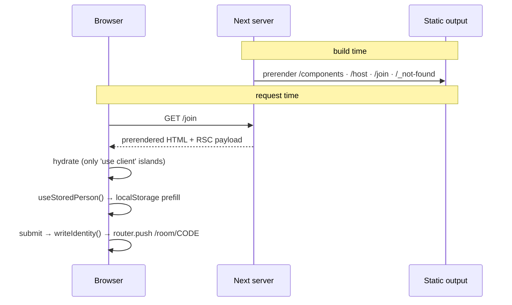

`/room/[code]` is the second path and it is the opposite shape: the server
renders an empty shell — the store's `getServerSnapshot()` returns the
never-connected room precisely so `useSyncExternalStore` has something to hand
SSR — and everything after that happens in the browser. There is no server
state. **What fills that wait is now a screen, and the wait is longer than the
one it used to cover.** The browser fetches a signed seat from `/api/ably/seat`,
connects, finds out by presence whether it is the host, and only then knows
which branch it is on: a host builds the room and the first render comes from
its own broadcast looped back in process; a guest's comes from the host's
`publishState` on its private state channel, after which it asks for a seat — or
for its old one back. That is one round trip plus a connection, and the tab
bus's claim probe is ~180ms of it.

`RoomShell` returns `RoomBootScreen` for all of it, in place of its own chrome
rather than around it, and hands over on `isSeated(snapshot)` — not on the first
broadcast, which only proves the room exists. If the room cannot be built at
all, or a host refuses the seat, the same screen carries the sentence in place
of its rail. Nothing below that guard may read `state`.

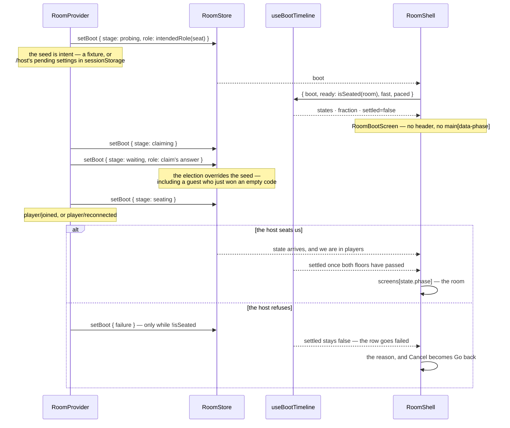

Two things that diagram is saying. **The stages are stamps on work that was
already happening**, not a script the screen plays — `bootTimeline` may hold a
row back but never runs ahead of one. And **a failure never settles**: the
screen it lands on is the screen that is showing, which is the whole reason the
refusal is routed to `boot.failure` rather than to a snackbar underneath it.

The third path is `/`, and it is the third shape: a Server Component that
**awaits remote data before it answers at all**, with a client island for the
part that has to move.

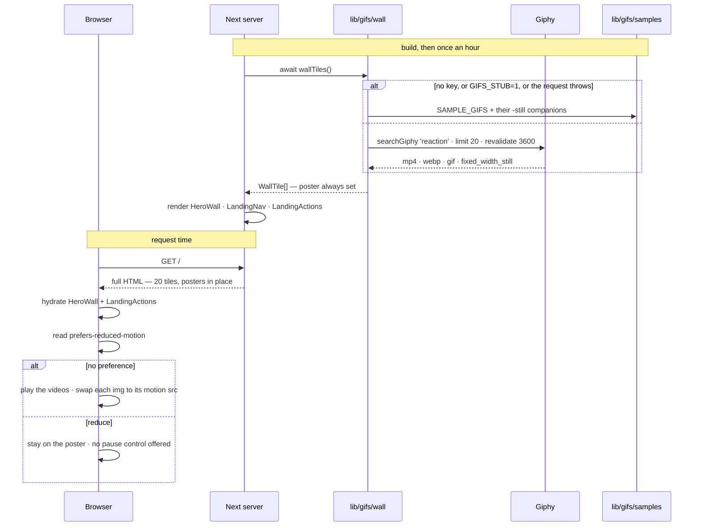

The order matters. **Every tile has a poster in the first response**, so the
wall is complete and correctly sized before a byte of script runs and nothing
shifts under the headline. Motion is added afterwards and only after the
preference has been read — playback starts `false`, and the effect that flips
it is the same one that reads the media query, so a visitor who asked for
stillness never sees a frame. A background this size is not an LCP candidate,
which leaves the 98px headline as what the metric actually measures, and it is
text.

`preload="none"` on the `<video>` elements is what keeps twenty tiles from
being twenty parallel downloads on first paint; the poster is already there, so
there is nothing to wait for. Twenty MP4s are roughly what two GIFs would cost,
which is why `wall.ts` prefers the `mp4` rendition and falls back to the
animated image only when a source has none.

The fourth path is the only one that leaves the machine at request time, and it
belongs to the GIF picker rather than to a page.

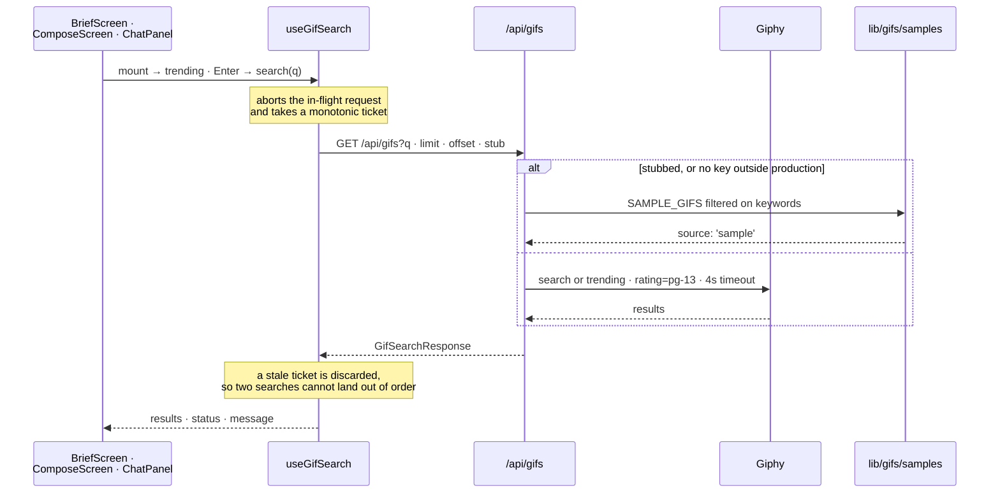

There is no debounce anywhere in that path, on purpose: the design's picker says
"Enter to search", so a request fires on submit and on a suggestion chip, which
deletes the debounce-and-race question entirely. What is left is the stale
guard. A picked result becomes a `MediaRef` through `toMediaRef()` and is
broadcast to the room — which is why the sample shelf is SVG files under
`public/media/` rather than data URIs, since a full-state message has to fit
inside Ably's 64KB cap. `public/media/` holds 28 files at its top level: twelve
animated tiles and a `-still` companion for each, because stopping an animated
image means swapping the file, plus phase 7's four Slackmoji reaction tiles.
One directory down, `public/media/emoji/` holds the imported catalog — **584
still SVGs and a `LICENSE.txt`, 2.79MB** — which is why the image allowlist
grew exactly one optional path segment rather than a wildcard.

**Phase 7 gave that path a third caller and a second destination.**
`ChatPanel` opens the same `GifPanel` in its `popover` variant, over the same
`useGifSearch` and the same route handler — the picker did not need a second
mode, because a GIF for a chat message and a GIF for a round are the same
search. What differs is where the result goes: a round's pick becomes a
`MediaRef` in `GameState` through `toMediaRef()`, while chat's becomes a
`ChatAttachment` on a `RoomEvent` and never reaches the reducer. Both ends of
that fork are the same URL from the same origin, which is what makes one
allowlist enough. Nothing in `lib/gifs/` had to change to serve it beyond the
allowlist itself.

**One field has since been added to what comes back, and it stops at the
picker.** `toResult()` reads the chosen rendition's `width` and `height` —
decimal strings on the wire, so a junk one is simply absent rather than `NaN` —
and `GifPanel` writes them onto each tile as a `--tile-ratio` custom property,
which is how a masonry column reserves a GIF's real shape *before* the image
arrives. It is a rendering hint and deliberately nothing more: `toMediaRef()`
drops it with `id` and `keywords`, so `GameState` and the wire are unchanged,
and a source that reports no dimensions still renders — at `$gif-tile-ratio`,
the stylesheet's stated fallback.

### The realtime path

The fifth shape is the room's own, and it is the GIF path's sibling: browser →
route handler → third party, with the credential stopping at the server. This
diagram has been owed since phase 2.

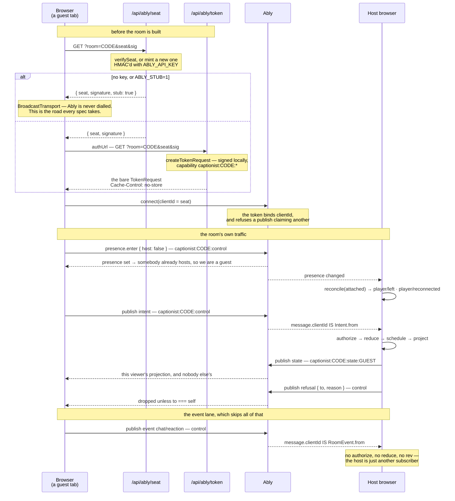

Four things that diagram is saying. **The key never leaves the server**, the
same way `GIPHY_API_KEY` never does — the browser presents a signed token
request and talks to Ably directly, so neither route is in the room's hot path.
**Control is one channel and state is many**: intents, events and refusals share
`captionist:<code>:control`, while each recipient has its own
`captionist:<code>:state:<playerId>` because `project()` is per viewer.
**Presence is the membership fact**, not a heartbeat we infer one from — it
elects the host, and the host reconciles it into `player/left` and
`player/reconnected` on every change. And **the event lane runs beside the
authority loop rather than through it**: a chat message reaches the host the way
it reaches everyone else, with `from` stamped from `clientId` on receive, and
`HostEngine` never sees it — [the event lane](#the-event-lane).

The stub branch is not a footnote. With no `ABLY_API_KEY` the whole right-hand
side of that diagram is unreached, and that is the state this machine is in.

---

## Not yet built

Designed but not implemented. The shape is settled — `DESIGNSYSTEM.md` and the
three `.dc.html` files specify all of it, and since the spine landed the state
model does too. What's missing is mostly code, in the order
[the roadmap](./roadmap.md#phases) gives; that table is the plan and is not
repeated here. **Two rows are not waiting on a phase at all**, and each says so
in place: custom team emoji is blocked by licensing, and uploads by a decision
that went the other way ([ADR 0014](./adr/0014-uploads-are-not-a-feature.md)).
They stay listed because the design draws both and a reader is owed the reason,
not because either is queued.

**A third category exists now and is deliberately not in this section.** A
*departure* — a value the design states and the code overrules — is not a gap,
so it does not belong in a list of what is missing. There are two: uploads,
above, and the media card's shape and caption scale
([ADR 0016](./adr/0016-a-media-card-is-square-and-a-caption-scales-with-it.md)).
Both are recorded where a reader would look for them — the ADR, and
[design-system.md](./design-system.md)'s departures table — rather than here,
because nothing about either is waiting on a phase.

Phase 4 removed two rows from this table rather than editing them. **Joining a
room** is built — the routes are in the [route map](#routes), the election that
decides who hosts is in [who hosts](#who-hosts), and the lobby's guest face is
`lobbyCopy(state, viewerId)`. **Player avatars** are built — `lib/avatar.ts`,
described under [room state](#room-state), and now a sixty-four-face catalogue
behind a shuffling picker rather than the seven that closed this row. Neither is
a promise any more.

Phase 5 removed the third. **Realtime transport is built**: `AblyTransport`,
`/api/ably/token`, presence UI and the reconnect overlay all exist, and the
interface did not change at the swap — [ADR 0009](./adr/0009-the-room-crosses-the-network.md).
The path is drawn in [the realtime path](#the-realtime-path). What remains is
not code, it is a gate, and it has its own section below rather than a row here:
nothing in this repo has ever run against Ably.

Phase 6 removed the fourth. **Chat and live tallies are built**: the store is
`lib/room/events.ts`, drawn in [the event lane](#the-event-lane) and reasoned
out in [ADR 0010](./adr/0010-chat-is-a-second-store-and-its-sender-is-stamped.md); `ChatPanel`
and `ChatToast` are in the [tier map](#component-tiers); the rail is a sheet on
a phone and docked above `md`; and the vote grid carries per-card reactions with
running counts. It left three pieces of the *design* behind, and phase 7 built
all three.

**Phase 7 removed those three rows.** *GIFs in chat* — the `chat` event carries
an optional `ChatAttachment`, `ChatPanel` opens `GifPanel` in its `popover`
variant, and a GIF on its own is a complete message. *The "replying to" quote
block* (Screens 2d) — `ChatQuote` is a denormalised `{ src?, caption }`, staged
on `RoomShellContext` and drawn by `ChatMessage`; the "what happens when the
quoted message falls off the 50-message cap" question this table used to pose is
answered by the quote being a copy, so the cap never touches it. *The four
Slackmoji tiles* (DESIGNSYSTEM.md §4.4) — the blocker was borrowed from user
uploads and did not apply: those are a *workspace's* uploads, these four are
ours, drawn as SVGs beside the sample shelf. All three are drawn in
[the event lane](#the-event-lane) and reasoned out in
[ADR 0011](./adr/0011-a-quote-is-a-copy-and-a-glyph-is-a-location.md). Uploads
kept their row below but inverted it: what exists is now *nothing* rather than a
blocked `Dropzone`, and what is missing is missing by decision
([ADR 0014](./adr/0014-uploads-are-not-a-feature.md)) rather than by a storage
target that never arrived.

**The catalog import removed no row and added one.** 616 reactions is not a gap
closed by time — the ask was slackmojis.com's directory, and it cannot be taken:
their terms forbid compiling it and the art is not theirs to license, so the
source changed and the goal survived as Noto under CC BY 4.0
([ADR 0012](./adr/0012-the-catalog-is-licensed-art-and-the-animation-is-borrowed.md);
attribution is on `/components` and in `public/media/emoji/LICENSE.txt`). What
is left out is the part no import can supply — a *workspace's own* custom emoji
— and it is the same missing storage target, now declined outright
([ADR 0014](./adr/0014-uploads-are-not-a-feature.md)).

| Area | What exists | What doesn't |
| --- | --- | --- |
| The round-flow screens | **All ten phases**, inside the `RoomShell` chrome drawn above — `opener` as the `RoundOpener` overlay, the other nine through the [tier map](#component-tiers). `PhasePending` is gone | Four pieces of the design, each left out for a reason rather than for time — see below the table |
| Iconography | `Icon` ships the design's own SVG paths | `@phosphor-icons/react` is installed and unused |
| Custom team emoji | 616 reactions from `lib/reactions.ts` — 32 authored, four of them Slackmoji-style, plus 584 Noto imports under CC BY 4.0 | A *workspace's* own emoji, which is what the ask meant. Blocked by licensing rather than by time — slackmojis.com's terms forbid compiling their directory and it does not own the art ([ADR 0012](./adr/0012-the-catalog-is-licensed-art-and-the-animation-is-borrowed.md)). The honest route is host-supplied URLs, which needs a storage target this app has decided not to acquire ([ADR 0014](./adr/0014-uploads-are-not-a-feature.md)) |
| Uploads | Nothing — Giphy is the only image source, in both modes | A *player's own file*, by decision rather than omission. The storage target was priced and declined ([ADR 0014](./adr/0014-uploads-are-not-a-feature.md)), and the `Dropzone`, the source tabs and the `/host` toggle were removed rather than left explaining themselves. `Player.src` is the same door on the avatar side and stays open: the prop exists, nothing populates it, and seeds cover every face the app draws |

The four omissions in the round-flow screens, in phase order:

| Screen | Left out | Why |
| --- | --- | --- |
| `waiting` | "Edit my caption" | Phase is room-wide and authoritative, so a guest cannot rewind the room to `compose`, and an inline editor would be a second composer to keep in step with the real one. `waitingCopy` was rewritten to match — it says what happens next rather than promising an edit that isn't offered |
| `vote` | The Caption \| Vote segmented control | Two views of one grid, and the vote is the one the phase is for |
| `reveal` | `auto-advancing in 6s` | `reveal` is untimed by design. The label would be counting a clock that does not exist; the host's advance button is the real mechanism, and `?bots=` supplies the [autopilot dwell](#dev-levers) instead |
| `podium` | The awards row, the highlight reel and the Slack buttons | Awards need a stat layer nothing computes yet; the reel and the share need a destination outside the browser |

Each of those is a *decision*, not a gap in the sweep — which is why they are
listed here rather than left for the next pass to rediscover.

**The boot interstitial is the one room surface with no design to omit
anything from.** `design/` draws sixteen state branches and this is not one of
them — the delivered prototype goes straight from the front door to the lobby —
so the screen was designed during the feature and the usual "the code omits what
the design draws" reading does not apply to it. Its own mockups drew three
things that were dropped for the reason the table above uses: two rows the app
has no work behind — reserving the room code, which is `generateCode(Date.now())`
and reserved nowhere, and loading a GIF deck, which nothing does at boot — and a
footnote promising the room stays open for 30 minutes, which no timeout keeps.
The rows were moved onto the sequence that really happens rather than the work
being faked to match the copy, and the footnote says the true half instead: a
player can join between rounds, which `lib/game/actions.ts` actually allows.
That is the rule rather than this screen's own excuse —
[ADR 0015](./adr/0015-a-progress-screen-may-not-invent-a-stage.md) — and it
prices the next loading surface too: prefetching a GIF deck at host boot is
still a reasonable feature, it just may not arrive attached to a sentence that
needed it to be true.

The component library is complete — see the inventory in
[design-system.md](./design-system.md#component-inventory). The design's
prototype has **16 state branches**. Three of them — landing, join and setup —
are routes rather than phases, because no room exists during them, and all three
are now built: `/`, `/join` (with `/join/[code]` as its prefilled twin) and
`/host`. The remaining 13, plus the round opener overlay, are the **14 in-room
states**. `RoomBootScreen` is a fifteenth surface and belongs to none of those
counts: it is the state of not having a room yet, which the prototype skips
over.
Those normalise to the **10 room phases** in `RoomPhase`
(`lib/game/types.ts`): `pick`/`pickwait`/`prompt`/`promptwait` are one phase
(`brief`) rendered four ways, and `caption`/`submit` are another (`compose`).
Phase is room-wide and authoritative; "is it my turn" is per-viewer and
derived, which is what makes *never fork a shared screen* a type-level fact
rather than a discipline. `BriefScreen` and `ComposeScreen` are that rule in
code: one organism each, seven faces between them — four brief, three compose —
and which one renders comes from `viewKey(state, viewerId)` in
`lib/game/selectors.ts`, so neither screen ever asks which mode the room is in.
Every string on them comes from `briefCopy` / `composeCopy` for the same reason.
Phase 3 finished the set: **nine screen organisms cover the nine non-opener
phases**, and the same discipline held — `waitingCopy`, `voteCopy`,
`tiebreakCopy`, `revealCopy`, `scoreCopy` and `podiumCopy` branch on mode inside
`lib/game/selectors.ts`, so not one of the six new screens reads
`state.settings.mode` at all. (`WaitingScreen` narrows on `answer.kind` to reach
`lines` — that is the union, not the mode.) `LobbyScreen` is the sole exception
and the honest one: it *sets* the mode. `MediaCard`'s `ownLabel` is the one
place the rule had been broken and is now fixed: "Your own caption" vs "Your own
answer" was hardcoded in the component, which meant a molecule knew what mode
the room was in.

**The client ↔ API-route ↔ Ably diagram is no longer owed.** It is
[the realtime path](#the-realtime-path), and it turned out to be exactly what
this section predicted: the same shape as the [GIF path](#rendering-path),
browser to route handler to third party with the credential stopping at the
server, and the two Ably routes are `searchGiphy`'s siblings in everything but
caching. The authority decision it extends is
[ADR 0003](./adr/0003-host-authority-over-a-swappable-transport.md); what phase
5 had to decide on top of it is
[ADR 0009](./adr/0009-the-room-crosses-the-network.md).

## What is verified, and what is not

210 unit tests (`lib/**/*.test.ts`, node, over 15 files) and 388 Playwright
tests across the two viewports — 194 per project, over 27 spec files. 378 of the 388 run; the
other 10 are viewport-gated (`test.skip` where a docked rail exists only above
`md`, or a floating dock only below it), which is a branch of the layout rather
than a hole in the coverage.

**The avatar change's share is 12 unit tests and five specs.**
`lib/avatar.test.ts` is the 12, and it is aimed at the two things a style swap
can break silently: that the background stays transparent and that no animation
comes back, both of which are values in a third party's JSON rather than in this
repo — the exact failure ADR 0008 warned about and now guards. It also holds the
catalogue to being sixty-four *distinct drawings* rather than sixty-four names
for a handful, and pins the original seven to indices 0–6, which is what stops a
stored seed falling out of the picker's opening page. `e2e/join.spec.ts` gained
the shuffle and the arrow-key walk — the two behaviours that only exist in a
real browser — and later three more when join took `/host`'s layout: both
actions in the viewport without scrolling, the wall present at 1440 and absent
at 393, and the seven code slots on one line with no overflow, which is the
only way to catch slots that shrank into the card instead of out of it — and `e2e/landing.spec.ts` gained one for the seeded proof row and
one that resizes the window and asserts the wall's grid is still exactly full,
which is the regression the `auto-fill` layout would have reintroduced quietly.

Phase 6's share is `lib/room/events.test.ts`, now 29 tests over the
receive-side guards, which is where a rate limit measured on the local clock can
be checked without waiting 1.5 real seconds — and `e2e/chat.spec.ts`, now 11 tests
per project that carry a message between two real tabs, badge the collapsed
rail, flood the limiter and put a tally on a vote card without disturbing the
ranking under it.

**Phase 7's share is 14 unit tests and one spec.** `lib/gifs/allow.test.ts` is
6 of them and is the *specification* of what an image may point at — a
lookalike host, `data:`, `blob:`, plain `http:` and an over-long URL each get a
case, so adding a second image source later is one edit measured against a
written contract rather than a judgement call. `lib/reactions.test.ts` is 8
more and locks the ordering invariants the slices depend on: 1–6 emoji, 7–10 the
Slackmojis, and the whole list unique by id and by label — 32 of them then, and
the same assertions over 616 now. The rest landed inside `events.test.ts`,
because the attachment, the quote and the glyph guard are all receive-side.
`e2e/reply.spec.ts` is 3 tests per project across the three
surfaces a reply crosses — raised on a vote card, staged in the shell, sent from
the rail — and the third one is the ADR's argument made executable: it plays the
round on and checks the quote is still legible after the grid it came from is
gone. `e2e/ably.spec.ts` drives the **seat** route through the
`request` fixture against its stub, with no credentials and no browser, the way
`gifs.spec.ts` covers Giphy; `e2e/reconnect.spec.ts` drops a real guest out of a
real room and reads the overlay over it.

**The catalog's share is 13 unit tests and one spec, and most of them assert a
floor rather than a happy path.** `lib/noto.test.ts` is 4 over `animatedSrcFor`:
a catalog still resolves, a Slackmoji and an emoji character resolve to `null`,
and a codepoint's dashes become Google's underscores. `lib/reactions.test.ts`
grew from 8 to 14 — the head-slices are asserted still intact at 616, ids and
glyphs are unique across the whole set, and `matchesQuery` is held to the
keyword search the picker used to do inline. `lib/gifs/allow.test.ts` grew from
6 to 9, and the important one asserts a **failure**: a `fonts.gstatic.com` URL
is still refused, because the animation is derived in each browser and never
sent. `e2e/reactions-catalog.spec.ts` is 4 tests per project, all of them
running with the CDN unreachable by construction — a pack pages in 60 at a
time and extends on scroll, a still *decodes* (`naturalWidth > 0`, so a broken
image fails rather than passing on being present), search reaches an emoji by
name, and a picked catalog tile lands in a live tally as a picture rather than
as `/media/emoji/1f427.svg` in text.

**The reaction affordance's own spec is `e2e/reactions-everywhere.spec.ts`, now
8 tests per project**, and the toolbox pass is most of the growth: reacting to
the room is asserted to be a *toolbox* tool and not a chat one, the picker is
driven from the toolbox and from the long tail behind it, and two tests cover
the dismissal that did not exist — a click outside and Escape. Three more hold
chat's half of the split: the composer offers its affordance on an empty log, a
composer emoji **posts** rather than vanishing into a burst, and a message
reaction lands on the message you aimed at rather than the newest. No unit test
changed in that pass, which is the honest reading of it — nothing moved in
`lib/`.

**The boot screen's share is `e2e/boot.spec.ts`, 6 tests per project, and
`lib/room/store.test.ts`, 8 in node.** Five of the six specs drive a real boot end to end, which is the
only place the thing under test exists: a host opens on the host's screen
*before* the claim resolves (the seed from `/host`'s pending settings), a guest
opens on the guest's and is not handed the room until its own name is in the
roster, the rows report their state in words as well as in shape, Cancel goes
back through the door each role came in by, and a cancelled host's rules do not
turn up in the next room this tab opens. The sixth is on `/components`, where
the four row states can be asserted exhaustively — on a live boot the last row
is `done` for the frame before the screen hands over, so catching it there would
be a race against the hand-off it causes. That the pacing floors make any of
this observable is the point of them; without `bootTimeline` the whole sequence
resolves in a few hundred milliseconds on the tab bus and there is nothing to
catch. **The unit half is the predicate itself.** `isSeated` is pure and
node-reachable, and being the one thing two independent paths agree on is
exactly what makes a browser-only proof too indirect: five of the eight pin the
cases the boot gate turns on — no broadcast at all, a room that exists without
you in it, a host on its own first broadcast, and a seat that is only
reconnecting — and the other three cover the boot channel: that the snapshot
opens on the role it was seeded with, that `setBoot` merges a patch rather than
replacing the progress, and that a patch changing nothing returns the *same*
object. That last one is the store's whole contract rather than a nicety —
`useSyncExternalStore` re-reads `getSnapshot` during render and loops forever on
a fresh one, and a merging setter is the easiest kind to get wrong.

**The 404's share is `e2e/not-found.spec.ts`, 5 tests per project and no unit
test, because nothing pure moved.** Two of the five are the ones a pretty error
page usually skips: the **status code** on an unmatched URL, since a 404 served
as 200 tells a crawler the URL exists, and the `notFound()` path through
`/room/not-a-code`, which asserts the markup and pointedly *not* the status —
Next answers a streamed segment 200 with the 404 in the body. A third asserts
the art is the offline shelf and reads its `src`, which is only meaningful
because the browser resolves no host but the dev server: a live Giphy URL there
would be a broken frame nothing caught. The other two are the ways out and the
tab order.

**`e2e/targets.spec.ts` narrowed what it claims, and that is worth reading as a
change in coverage rather than a fix.** Its `hits()` helper now drops a control
whose every sample point resolves to painted ground on top of it. The cause is
the vote screen's lock dock — `position: sticky; bottom: 0` over a solid
background, deliberately not a fade, so caption text is not legible through
it — which means a phone voter always has *some* card's foot row buried under
it. That is how a sticky bar over a scrolling grid works and the row is not
offered to anybody: you scroll, and it appears. What the spec still catches is
the thing it exists for — two controls the viewer can **see**, one silently
taking the other's tap — because a control is dropped only when all five points
are occluded, and the bug that motivated the file (the lock button's right end
under the chat key) has an unoccluded centre. The decision, and the standing
cost of it — content under a sticky surface is out of scope now, so a *second*
sticky surface is the moment to re-read rather than assume — is
[ADR 0017](./adr/0017-a-buried-control-is-not-a-stolen-tap.md).

**The Ably path has now been driven by hand, once.** With a key in
`.env.local`: three clients connected, shared a roster, started a round, and a
guest closing its tab turned into a held seat through Ably presence. Two bugs
surfaced doing it — the `authUrl` returned an envelope, which the SDK rejects
outright, and a `?phase=` fixture asked the server for a seat it would never
use. Both are fixed; neither was reachable from any test.

**But no test touches Ably.** `playwright.config.ts` sets `ABLY_STUB: '1'` and
`GIFS_STUB: '1'` on the dev server it spawns, so `/api/ably/seat` answers
`stub: true`, `transportKind` resolves to `broadcast`, and every spec in the
repo — `twotabs`, `reconnect`, `chat`, all of it — exercises the tab transport.
That switch is stated rather than inherited from whether this machine has a key,
so a key in `.env.local` does not silently move the suite onto a live service.
`AblyTransport` itself, the presence election and
the token's Ably half have **no automated coverage at all**. That is the price
of a hermetic suite, and it is why
[the roadmap](./roadmap.md#phases) records phase 5's gate — two devices on the
same wifi — as unverified rather than done. This file says the same thing rather
than implying the swap is proven.

Three things will bite on the first real run, and all three are configuration
rather than code:

- **`allowedDevOrigins: ['127.0.0.1']`** in `next.config.mjs` does not include
  the LAN address a phone types in, so `next dev` will block its own chunks as
  cross-origin for the second device.
- **The `authUrl` must return the bare `TokenRequest`.** Ably rejects an
  envelope — "The returned object has neither a keyName nor an issued field" —
  which is why the seat lives at `/api/ably/seat` and the token at
  `/api/ably/token`, rather than one route answering both.
- **`NEXT_PUBLIC_APP_URL` must stay unset**, or the lobby's QR encodes
  `localhost` and is a dead link on any device but the one that drew it.
  `.env.example` now ships it blank, with the reason beside it.

## Conventions worth knowing before you edit

1. **`CLAUDE.md` is ours; `AGENTS.md` is Next's.** `next dev` regenerates the
   block between `<!-- BEGIN:nextjs-agent-rules -->` markers in `AGENTS.md` and
   skips `CLAUDE.md` entirely while that block lives there. Put project rules in
   `CLAUDE.md`.
2. **The repomix pack is an input, not a doc.** `docs/repomix-output.xml` is
   gitignored; this file is the committed output derived from it.
3. **Never run `playwright install`.** The browser cache is provisioned; see
   [ADR 0002](./adr/0002-pin-playwright-to-browser-build.md).
4. **State goes in `lib/`, markup goes in `components/`.** Providers, stores
   and hooks live in `lib/room/` even though they are React. `lib/game/` stays
   importable from a node test with no DOM — keep React, `Date.now()` and
   `Math.random()` out of it.
5. **Pure logic is Vitest's; anything rendered is Playwright's.** The unit
   suite is scoped to `lib/**/*.test.ts` on purpose — components are verified
   against the real browser this app ships to, not a simulated DOM. Screen copy
   counts as pure logic: it lives in selectors, so `lib/game/selectors.test.ts`
   asserts the words and the specs assert the wiring. `/api/gifs` is tested
   through Playwright's `request` fixture rather than a browser, against the
   stub — a spec that depends on a live third party is not a test.
6. **Room state or routing makes an organism.** That is the whole test — not
   size, not how much markup it holds. A component that calls `useRoom()` or
   pushes a route belongs in `components/organisms/`; one that only needs props
   stays a molecule so the gallery can still render it. `RoomShell` is the state
   case; `LandingActions`, `JoinScreen` and `HostSetupScreen` are the routing
   case, and none of the three could call `useRoom()` if it wanted to — there is
   no room until after the push.
7. **Media that can move ships a still, and motion is opt-in after the
   preference is read.** Anything animated carries a companion still frame —
   `GifResult.still`, `WallTile.poster`, the `-still` SVGs in `public/media/` —
   and it is that frame the first render shows. **The emoji catalog satisfies
   this by construction rather than by discipline:** the still is not a
   companion somebody has to remember to draw, it is the thing on the wire, and
   the animation is the departure from it. The preference itself is read in one
   place, `lib/useReducedMotion.ts`, by both components that have to choose a
   file rather than a CSS rule. Playback is enabled only inside the effect that
   reads `prefers-reduced-motion`, so it never starts and then
   gets cancelled. This is a rule rather than a preference because CSS cannot
   reach inside an animated image to stop it, and an SVG used as an `` does
   not reliably inherit the page's motion preference — the only reliable stop is
   swapping the file (or pausing a `<video>`). Anything that stops for a
   preference also gets a visible control, since some people want stillness
   without having set the system flag.
8. **Selectors passed to `useRoomSelector` must be module-level.** The cache is
   keyed on snapshot identity, so an inline closure that changes meaning
   between renders would be served from cache.
9. **Every *room* screen uses `useRoom()`. `useRoomSelector` is still unused.**
   (`JoinScreen` and `HostSetupScreen` are not room screens — there is no room
   while they are open.) This
   doc used to predict the vote grid would be its first customer; phase 3 built
   the vote grid and it wasn't. `VoteScreen` holds its ranking as local draft
   state and dispatches one `round/ballotCast` when the button is pressed —
   [ADR 0006](./adr/0006-a-ballot-is-a-draft-until-it-is-locked.md) records why
   that is a correctness decision rather than an ergonomic one. Nothing in the
   room is a list long enough to pay for the cache yet.
   Phase 6 settled that bet somewhere unexpected: the live tally arrived, and it
   was `useEventSelector` — the same double cache over the *event* store — that
   got the customers. `ChatPanel` and `VoteScreen` each read the whole tally
   record in one subscription, because a per-row `useTallies` would be a hook
   inside a list. `useRoomSelector` itself is still unimported, and stays as the
   twin the event one was copied from.
10. **Nothing time-varying goes in either store.** `getSnapshot()` must return a
   stable reference or React 19 loops — that holds for the event store as much
   as the room's, which is why a tally record rebuilds only the key that moved.
   Clocks are derived in `useCountdown`, and refusals are delivered as a
   subscription rather than parked in state.
11. **A seat is per tab; a person is per browser — and the seat is signed.**
   The player id lives in `sessionStorage` beside the server's HMAC over it, the
   nickname and face in `localStorage`, and the two storages must not be merged:
   one id shared across tabs seats both of them in the same chair. Anything else
   a tab needs to carry into the room goes the same way `pendingSettings` does:
   written on the way out, cleared on use.
12. **`isHost` is learned, not given.** It is the answer to a presence
   election on Ably and to a claim probe on the tab bus, so it starts `false`
   and arrives via `store.setIdentity`. Nothing may assume host-ness at mount —
   a tab that does flashes the host's controls at a guest. **`boot.role` is the
   one thing that guesses, and it is not the same fact:** it decides which
   *interstitial* opens, from what this tab meant to do, and the election
   overwrites it. Nothing but the boot screen may read it, and nothing
   authoritative may be drawn from it.
13. **A real room is Ably; the tab transport is the suite's.** Which one a room
   gets is `transportKind(levers, stubbed)` in `lib/room/connect.ts` and nothing
   above `useRoom()` may ask. Unlike Giphy there is no offline stand-in for
   other people, so `BroadcastTransport` is a test road and a two-tab
   convenience, never a production fallback — and any spec that needs a network
   is a spec that cannot run here.
14. **Nothing on the wire is trusted, including a `clientId`.** `Intent.from`
   comes from the transport's authenticated sender — `message.clientId` stamped
   by Ably from the token — never from a payload, and `/api/ably/token` refuses
   an unsigned seat rather than minting a token for whatever id it was handed.
   A token response is `no-store`; it is the one response in the app that must
   not be cached. **Both lanes, not just intents:** since phase 6 every
   transport overwrites `RoomEvent.from` on receive with the identity it
   authenticated, so "post as anyone in the room" is not reachable by editing a
   payload. The guards that follow — membership, rate, length — run on receive
   for the same reason: a check the sender could decline to run is not a check.
15. **A URL from a sender is not trusted either.** Stamping `from` settles who
   spoke; it says nothing about where their words point, and a chat attachment,
   a quote's thumbnail and a reaction's glyph all become an `` in
   twenty other browsers. Everything sender-supplied clears
   `isAllowedImageSrc` in `lib/gifs/allow.ts` — same-origin `/media/*.svg` or
   `/media/emoji/*.svg`, or a `giphy.com` host over `https:`, parsed with `URL`
   — and it is checked on **receive**, so it holds on every transport. A failed
   check *degrades* the message rather than refusing it: the picture goes, the
   words stay, and only an empty message is dropped. Adding a second image
   source is one edit in one file, and `lib/gifs/allow.test.ts` is the contract
   it has to meet. **The emoji catalog is the case that proves the rule rather
   than bending it:** its
   animation lives on `fonts.gstatic.com` and that host is still refused,
   because the URL is derived in each browser from a same-origin still and
   never travels. Growing the catalog from 32 to 616 widened the allowlist by
   one optional path segment and by no host at all.
   [ADR 0011](./adr/0011-a-quote-is-a-copy-and-a-glyph-is-a-location.md) ·
   [ADR 0012](./adr/0012-the-catalog-is-licensed-art-and-the-animation-is-borrowed.md).
